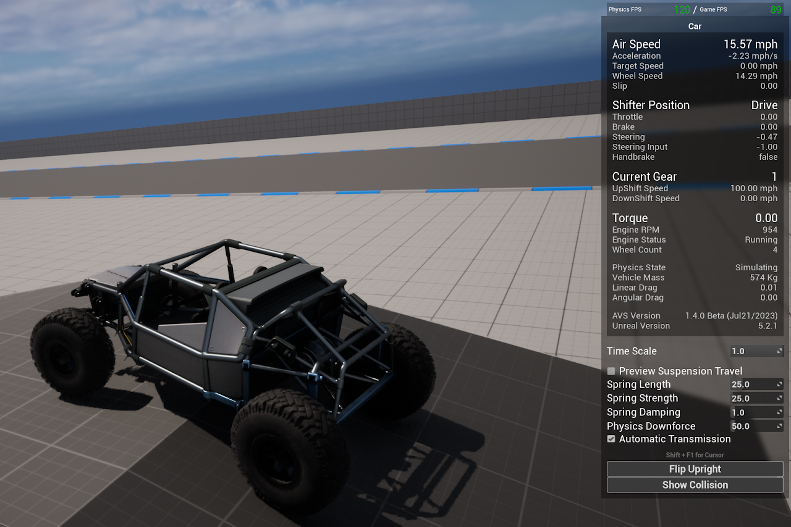

# Debugging

Tools for diagnosing a vehicle that is not behaving correctly, in the order to try them.


## Basic Understanding

There are three tools, and they answer different questions.

**The config assist HUD** shows live vehicle state while you drive, and lets you change spring values without leaving the game.

**The debug visualizers** draw things you cannot otherwise see — the real center of mass, suspension traces.

**`stat AVS`** reports what the plugin is costing, and how many vehicles are actually awake.


## Config Assist HUD

The plugin includes a HUD for building and tuning vehicles. It shows live vehicle state and lets you change spring values while driving, which is much faster than editing components and pressing play again.

<!-- side-by-side:57 -->
Setup is covered in step 5 of the [Quick Start guide](https://overtorque-creations.com/Dev/Docs/#AVS/Getting_Started/Quick_Start.md). Once it is running, press **Shift + F1** to get your cursor back so you can use the sliders.

Read the state panel before changing anything. Air speed, shifter position, current gear, torque, engine status and wheel count answer most questions immediately. A vehicle in Park with the engine off is a different problem from one in Drive producing no torque.

<!-- split -->

<!-- /side-by-side -->


## Config Assist HUD Spring Sliders

Spring values from the HUD apply to **every wheel**, overriding your per-wheel configuration, and are not saved.

That is what makes it fast for finding a baseline, and why you copy the numbers back into the components when you are done.


## Debug Visualizers

Under **Advanced Vehicle System → Debug**:

| Setting | Shows |
|---|---|
| **Visualize Center of Mass** | The actual physics center of mass, after every offset |
| **Suspension Debug** | Suspension traces and state |
| **Display Debug Menu** | The in-game debug menu, also toggleable with `ShowDebugMenu` |

Enable **Visualize Center of Mass** first when a vehicle handles strangely with no obvious cause. A center of mass in an unexpected position explains a large share of handling problems, and it cannot be confirmed by looking at the vehicle.


## Wheel Editor Preview

**Editor Preview**, under the wheel's Suspension Dynamics, draws wheel travel in the viewport.

This makes it obvious when spring length does not fit the wheel well.


## Profiling with stat AVS

`stat AVS` opens the plugin's stat group — the full tick pipeline plus **Active Vehicles**, **Simulated Wheels**, and **Wheels In Contact**.

Check the counters before the timings. See [Tick and Performance](https://overtorque-creations.com/Dev/Docs/#AVS/Advanced/Tick_And_Performance.md) for how to read it.


## Useful Console Commands

```text
stat AVS          Plugin tick pipeline and vehicle counters
stat Physics      Engine-side physics cost
stat FPS          Frame rate, for comparing against the physics rate
```


## Common Problems and Fixes

| Symptom | Usual cause |
|---|---|
| Vehicle will not move | Engine off, or still in Park. A vehicle spawns with both. Then check a wheel has **Is Driving Wheel** on. |
| Stops responding after sitting still | It went passive. See [Tick and Performance](https://overtorque-creations.com/Dev/Docs/#AVS/Advanced/Tick_And_Performance.md). |
| Wheels bounce or misbehave at speed | Physics wheel mode with non-sphere collision, or engine contact offsets left at default. |
| Wheels will not reach high speed | Engine **Max Angular Velocity** too low. See [Project Settings](https://overtorque-creations.com/Dev/Docs/#AVS/Getting_Started/Project_Settings.md). |
| Skeletal mesh parts jitter violently | Physics constraints defined inside the mesh's Physics Asset. Move them to the vehicle Blueprint. |
| Inputs do nothing in multiplayer | Called from a non-owning client. See [Networking](https://overtorque-creations.com/Dev/Docs/#AVS/Advanced/Networking.md). |
| Vehicle see-saws on another physics object | Turn off **Wheels Push Physics**. |
| Effects cut off abruptly | An effect destroying its particles instead of deactivating them. See [Custom Effects](https://overtorque-creations.com/Dev/Docs/#AVS/Wheel_Effects/Custom_Effects.md). |


## Getting Support

If none of that covers it, the `#avs_support` channels on [Discord](https://discord.gg/8YvWARS) are the fastest way to reach me, or send an email.

Include your Unreal version, your AVS version, and whether you are using raycast or physics wheels. Those three answer most of the first round of questions.
