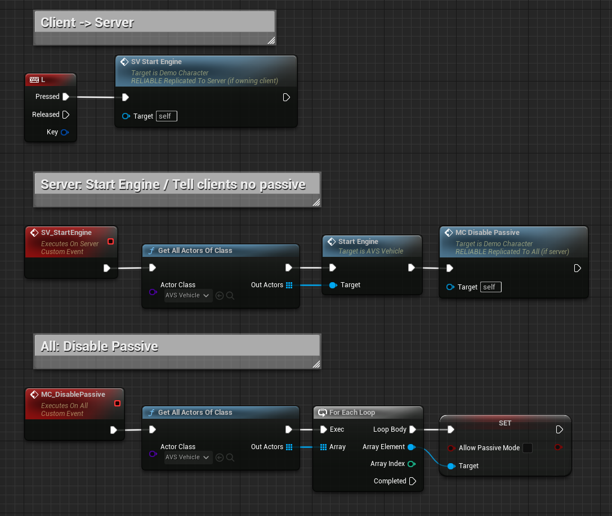
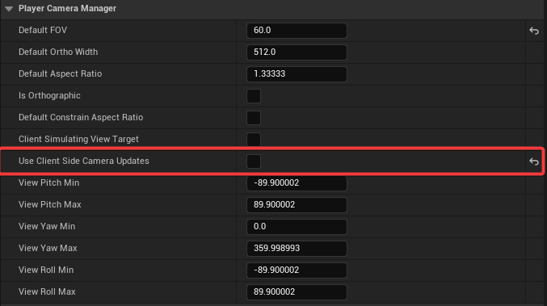

# Networking

AVS vehicles replicate out of the box and the defaults work for most projects. You need this page when tuning for a specific connection profile, or when something is desyncing.


## Basic Understanding

Physics vehicles are difficult to replicate because the server and clients never simulate identically. Instead of keeping every simulation in step, AVS replicates vehicle state and has clients follow it.

Two things follow from that, and they cover most of this page:

**The vehicle's network type** decides how a client follows the server — buffered and smooth, or predicted and immediate.

**Input functions only work from the owning client or the server.** Calling them anywhere else does nothing and reports no error.


## Network Type: History Interpolation

This is the default.

Clients buffer incoming states and play them back slightly behind the server. Smooth, stable, and forgiving of jitter.

The cost is latency, since remote vehicles are always a little behind reality.


## Network Type: Client Prediction

Clients simulate ahead and correct against server state.

More immediate, at the cost of correction artifacts when a prediction turns out wrong.

Use it when remote vehicle responsiveness matters more than smoothness.


## Calling Input Functions on Client and Server

Input functions are replicated, but where they are called from decides whether they do anything.

<!-- side-by-side:57 -->
In single player, call them from anywhere. In multiplayer they only work from the **owning client** — the client possessing the pawn — or from the server.

Calling `SetThrottleInput` on a non-owning client does nothing, and produces no error.

`isOwningClient` is the check to make before calling input functions from anything that might run elsewhere.

`SetLocalEngineRunning` is the deliberate exception, for local-only cosmetic changes.
<!-- split -->

<!-- /side-by-side -->

```cpp
void AMyVehicle::ApplyThrottle(float Value)
{
	// Input functions do nothing on a client that does not own this pawn.
	if( !isOwningClient() ) return;

	SetThrottleInput(Value);
}
```

The same applies to hitching. `Hitch` and `HitchToOverlapped` must come from the owning client or the server.


## Reaching a Vehicle You Do Not Own

When the call has to come from somewhere that does not own the vehicle, route it through something that does.

The pattern is to put a Server RPC on an actor the client owns — usually the player's own pawn or controller — have the server do the work on the vehicle, and multicast the result if clients need to react.



The same reasoning covers anything that changes vehicle state from outside the vehicle, not only input functions.


## Core Network Settings

Settings under **Advanced Vehicle System → Network**. These three are usually left alone.

**Movement Replication** decides whether movement replicates at all, and **Sync Location** and **Sync Rotation** control position and rotation individually. All three default to on, and can be changed at runtime.


## Advanced Network Settings

| Setting | Default | Raise it to | Lower it to |
|---|---|---|---|
| **Net Send Rate** | `0.05` s | Save bandwidth | Update more often |
| **Net Time Behind** | `0.15` s | Absorb jitter on poor connections | Tighten responsiveness |
| **Net Lerp Start** | `0.35` | Tolerate more drift before correcting | Correct sooner |
| **Net Position Tolerance** | `0.1` | Ignore small differences | Correct more precisely |
| **Net Smoothing** | `10.0` | Correct faster, more visibly | Correct gently |
| **Net Use Smoothing** | `true` | — | Turn off to apply corrections directly, with no smoothing |


## Net Time Behind

**Net Time Behind** is the main trade on this page.

More absorbs packet loss and jitter, at the cost of remote vehicles lagging further behind reality.

Less is tighter, but makes bad connections obvious.


## Net Send Rate

Do not lower **Net Send Rate** without measuring.

With many vehicles it is the setting most likely to cost you real bandwidth.


## How Vehicle State is Sent

Movement state goes over **unreliable** RPCs. A dropped packet is simply replaced by the next one, which is what you want for a value that updates constantly.

The **resting** state is sent **reliably**, once, when a vehicle settles. It is the authoritative final position.

That split explains a behavior people notice: a vehicle that looked slightly out of place while moving snaps to the correct position the moment it stops, because the reliable rest update has arrived.

> Under heavy network load, unreliable movement packets are the first thing to be dropped. If vehicles drift while moving but correct themselves on stopping, look at total networked actor count before changing AVS settings.


## Network Rest State

Vehicles that come to a stop stop sending updates, rather than repeatedly sending an unchanged position.

**Rest Velocity Threshold** under **Advanced Vehicle System → Physics** decides when that kicks in, and it is the same threshold passive mode uses.

> If parked vehicles are drifting out of sync on clients, that threshold is too high.


## Trailer Networking

Trailer sync is automatic once a hitch connection is made. Reworked in 1.5 with an adaptive send rate — trailers update more when they need to and back off while resting.

The current implementation supports a single tow hitch and trailer hitch pair. Hitch chains are not yet supported, so a truck towing a trailer towing another trailer is outside what the networking handles today.


## Disabling Movement Replication

`SetMovementReplicationEnabled` disables replication temporarily. 
It does not change the configured **Movement Replication** setting.

Use it when something else takes over the vehicle's movement — a cinematic, attaching it to another actor, or your own movement code.

Turning it off for the duration stops AVS and your system fighting over the transform, and re-enabling restores normal behavior.


## Towing or Carrying a Vehicle in Multiplayer

A vehicle held to another vehicle by your own constraints needs its movement replication turned off.

If both machines keep replicating the towed vehicle's position while the constraints are also moving it, the server and the client fight over its transform. The result is a body that lags behind, then eventually explodes.

1. Build the connection so the **constraint positions are identical on the server and the client**.
2. Once the connection is made, call `SetMovementReplicationEnabled(false)` on the towed vehicle.
3. Re-enable it when the connection is released.

The constraints keep the two vehicles in sync from that point, which is what replication would otherwise be doing badly.

> This applies to your own constraint-based towing. The [hitch system](https://overtorque-creations.com/Dev/Docs/#AVS/Components/Hitch_Trailers.md) handles its own trailer sync and does not need this.


## Using a Third Party Networking Plugin

Turning off **Movement Replication** disables only the code that replicates location, rotation and velocity. It hands the transform to something else — a replication plugin, or your own system.

Throttle, brake, steering and handbrake stay replicated regardless. They are specific to AVS and are not something an external transform-syncing plugin can carry.

So the arrangement is: your plugin syncs the transform, AVS keeps syncing the inputs.


## Network Relevancy and Server Side Relevancy

Unreal decides what is relevant to a client from where the server believes that client is viewing from. By default it relies on **client side camera updates**, and those are driven from player characters rather than generic pawns.

AVS handles this itself, the same way Chaos Vehicles does — while a client is driving, the vehicle asks the player camera manager to send the server a camera update, so the server's view location stays current and actors around the player are not culled.

That relies on **Use Client Side Camera Updates** being enabled on the camera manager, which is Unreal's default. It explains why a vehicle pawn behaves correctly here when a plain custom pawn would not.

**Server side relevancy is an alternative, and is arguably the better arrangement:**

1. Create a Player Camera Manager class, or open the one you already use.
2. Set your player controller to use that camera manager.
3. Disable **Use Client Side Camera Updates** on it.



The server then computes relevancy itself, which covers every pawn type rather than only the ones that send updates.

> If actors are being culled at distance, raising **Net Cull Distance Squared** or marking the vehicle **Always Relevant** will hide it. Both cost real bandwidth and neither addresses a stale view location.
