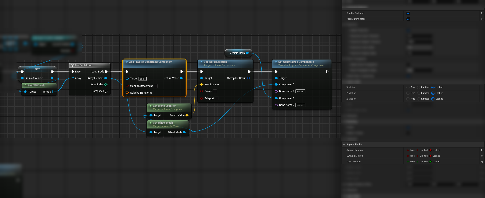

 # Attaching Objects to a Vehicle

Plows, roof racks, cargo, weapons, characters in a seat — anything you bolt onto a vehicle and expect to move with it.

The rules below are Unreal's, not AVS's. Getting them wrong produces a vehicle that handles strangely or shoves other objects around.

## Basic Understanding

There are two ways an object can ride on a vehicle, and they behave completely differently.

**Welded** means the object's collision becomes part of the vehicle's physics body. Its shape and mass count toward the vehicle's simulation.

**Attached but not welded** means the object follows the vehicle's transform without affecting its physics at all. It is along for the ride and nothing more.

Which one you get is decided by *what you attach to*, not by a setting.

## Welding a Collision Mesh to the Vehicle

To weld, a static mesh must be attached **directly to `VehicleMesh`**.

Welding means multiple physics bodies act as one. A snow plow welded to the front of a truck adds its collision to the truck, so the truck can push snow with it and the weight is part of the simulation.

An object attached further down the hierarchy — to a child component, or to another attached mesh — will not weld to the root body.

## Skeletal Meshes Cannot Weld

A skeletal mesh cannot weld to a static root body.

If a skeletal part needs to affect vehicle physics, there are two options:

- **Fake it with a collision mesh.** Add a static collision mesh directly to `VehicleMesh` and drive it to follow the bone's location.
- **Use a physics constraint.** Join the two with a physics constraint rather than attaching them.

This is also why AVS wants the vehicle's root to be a **static mesh**, with skeletal meshes attached as children for visuals. See [Important Information](https://overtorque-creations.com/Dev/Docs/#AVS/Getting_Started/Important_Information.md).

## Character Collisions on a Vehicle

> Make sure character meshes — skeletal mesh, capsule, weapons — do not collide with the vehicle.

A character attached to the vehicle with collision still enabled acts as an **immovable object**. It will push simulated physics objects of any weight around as though they were not there, including the vehicle it is riding on.

Disable collision on anything you attach to a seat. In multiplayer, confirm it is disabled on clients as well as the server, since a character whose collision is only disabled on the server produces physics that disagree between machines.

## Carrying a Vehicle on Another Vehicle

A vehicle loaded onto a flatbed is not an attachment problem, it is a constraint problem.

There are two ways to do it, and they trade setup effort against how it looks.

**Constraining the body** is the simpler one. Spawn a physics constraint at the carried vehicle holding it at the socket location, give the constraint a limited Z so it can move a little under load, and set the carried vehicle's wheels to physics mode so its weight transfers properly.

**Constraining each wheel** looks considerably better. The carried vehicle settles on its own suspension and reacts to the carrier's movement the way a real load would, instead of being held rigid at one point. It is more work to set up, and noticeably more in multiplayer.

## Constraining a Carried Vehicle's Wheels in Multiplayer

The constraint positions have to be identical on the server and on every client, so the arrangement has to be replicated rather than recreated locally.

Build a struct holding a **relative transform** and a **wheel index**, one entry per wheel on the carried vehicle.

**On the carrier, server side,** when the vehicle is loaded: fill an array of that struct and replicate it with a RepNotify.

**In the RepNotify on clients:**

1. Disable movement replication on the carried vehicle.
2. Loop the array. For each entry, get the wheel mesh by its wheel index, move the wheel mesh to the relative transform, create the constraint at that transform, and constrain the wheel mesh.

Replicating an empty array then serves as the unload — clients see the array clear and release their constraints.

## Building the Wheel Constraints

The constraint setup itself is the same on the server and on clients. For each wheel of the carried vehicle:

1. **Add a Physics Constraint Component** to the carrier.
2. **Set its world location** to the wheel mesh's world location, so the joint sits at the wheel rather than at the carrier's origin.
3. **Set Constrained Components** to the carrier's `VehicleMesh` and that wheel's mesh.

Lock every axis — **X**, **Y** and **Z Motion** locked, and **Swing 1**, **Swing 2** and **Twist Motion** locked. The wheel is being held in place; the carried vehicle's own suspension provides the movement.

Enable **Disable Collision** on the constraint so the wheel and the carrier do not collide, and **Parent Dominates** so the carrier drives the pair rather than being pushed by the load.

`GetWheels` returns the carried vehicle's wheels, and `GetWheelMesh` on each one gives the mesh to constrain.

> Disabling movement replication on the carried vehicle is the part that matters. Without it the server and client fight over its position, which produces a lagging body and eventually a physics explosion. See [Networking](https://overtorque-creations.com/Dev/Docs/#AVS/Advanced/Networking.md).
