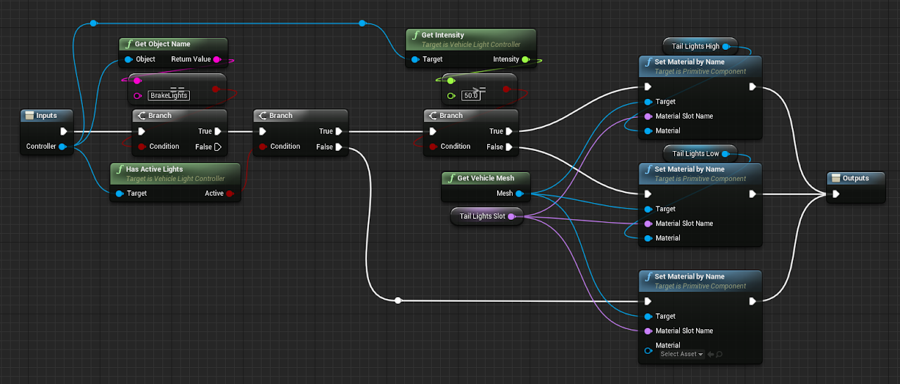

# Creating Lights for your Vehicle

## Light Groups and Relations

Lights in the Vehicle System are controlled by multiple `AVS_LightController` components within your vehicle. Every vehicle has a list of _Groups_ that the Light Controllers use to determine the correct intensity. These groups can be thought of as Booleans, they are either on or off. Lights placed as subcomponents of the light controllers will have their Intensity setting driven automatically using the relationship settings defined within their respective controller. When a group is activated, each light controller containing that group will loop through its relationships, setting all of its lights intensities to the highest active group on the hierarchy. This effectively allows us to create complex setups where every light on the vehicle can be driven by any amount of variables.

## Light Group Example: Headlights and Blinkers

<!-- side-by-side:50 -->

<!-- split -->
This is the muscle car from the demo project.

When you turn your headlights on in a real car usually the blinker lights will turn on as well, but at a low intensity. The muscle car is recreating this by defining a relationship with the _HeadLights_ group, setting the intensity of the light to 10 if that group is active.

This means that when the head lights are on, the blinker will also activate, but since its the lowest on the hierarchy, the _BlinkerLeft_ group will override it when it is also active.

Now imagine you have some code that clicks the blinker on and off, by toggling the _BlinkerLeft_ group. When the blinker group is inactive the blinker will set itself to 0, but if the headlights are on, it would set it to 10. Therefore mimicking a real blinker perfectly.
<!-- /side-by-side -->

## Controlling Light Groups

<!-- side-by-side:41 -->

<!-- split -->
Controlling the Light Groups is super easy. You can activate and deactivate groups with the following blueprint nodes within the Vehicle.

- **ToggleLightsActive**
- **SetLightsActive**
- **GetLightsActive**
- **UpdateLights** (Applies your changed Light Groups)

> _Note:_ You will need to call the **UpdateLights** function after changing your Light Groups, this is for performance reasons as you might want to change multiple light groups at once.
<!-- /side-by-side -->

## UpdateLightDecorations Event

<!-- side-by-side:50 -->

<!-- split -->
When your Vehicle Lights are updating, the **UpdateLightDecorations** event is called once per Light Controller. This is meant to be used for extra effects you want to apply to the vehicle, such as updating materials on the vehicle mesh or playing sounds. You can also just override the **UpdateLights** function if you want to update everything at once instead, just be sure to call the parent function.

The Light Controllers have 2 functions you can use to determine how to update your decorations:

**GetIntensity**, and **HasActiveLights**
<!-- /side-by-side -->

## Light Relation Settings

Each entry in a light controller's **Relations** array is one rule: when a group is active, set this controller's lights to this intensity.

**When Group Active** is the light group name the rule watches, and **Set Intensity** is the intensity to apply while that group is active.

A controller with several relations uses the **highest** intensity among the rules whose groups are currently active, which is what produces the blinker-over-headlights behavior described above.

## Setting Light Intensity Directly

`Illuminate(NewIntensity)` sets a controller's intensity without going through the group system.

`GetIntensity` reads the current value, and `HasActiveLights` is true whenever intensity is above zero.

Use `Illuminate` for lights that are not a simple on/off group — a dimmer, a light that fades with damage, or an emergency beacon driven by its own curve.
