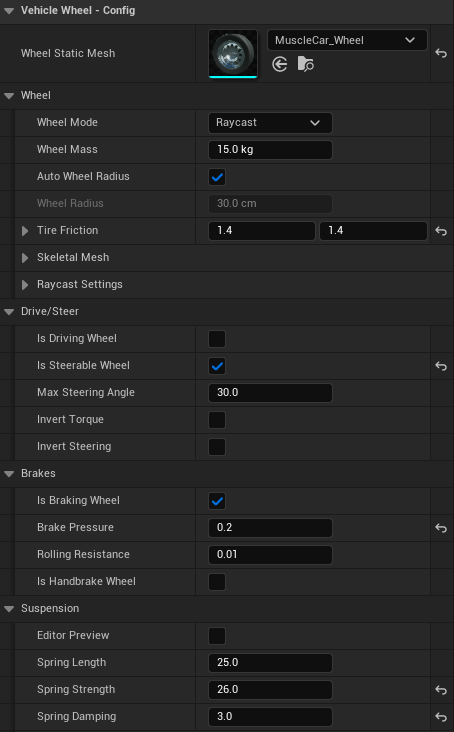

# Wheels

This page walks through putting wheels on a vehicle and getting them to drive well. The example throughout is an ordinary rear wheel drive car with four wheels.

Every wheel setting is listed in the [Wheel Settings](https://overtorque-creations.com/Dev/Docs/#AVS/Reference/Wheel_Settings.md) reference. Changing wheels while the game runs is covered in [Wheels at Runtime](https://overtorque-creations.com/Dev/Docs/#AVS/Components/Wheels_At_Runtime.md).

## How Wheels Work

A wheel is an `AVS_Wheel` component placed under the vehicle mesh. Adding the component is all it takes to add a wheel. There is no wheel list to fill in and no axle setup.

Each wheel carries its own settings. A wheel steers because its own **Is Steerable Wheel** is on, and drives because its own **Is Driving Wheel** is on. Where it sits on the vehicle makes no difference to what it does.

Every tick, each wheel traces down to find the ground, and its suspension pushes the vehicle up from whatever it hits.

## Raycast or Physics: Choosing a Wheel Mode

AVS has two wheel modes, and has been designed so you can seamlessly switch between them at runtime depending on your needs.

<!-- side-by-side:50 -->
**Raycast**

This is the more traditional approach, the wheel is a trace against the world. Nothing physical is there.

Fast, stable, and forgiving. It ignores the wheel mesh's collision entirely, so a bad collision shape does not matter unless you intend to detach the wheel.

This is typically the default mode games use. Use it unless you have a specific reason not to.
<!-- split -->
**Physics**

The wheel is a real physics body held on by constraints. It is considerably more expensive, and it inherits collision from your wheel mesh. Friction in this mode is handled entirely by the physics engine, therefore you need to make sure your physics materials are setup properly.

Use it when you need real wheel collision or the [Connect to Bone](https://overtorque-creations.com/Dev/Docs/#AVS/Skeletal_Mesh/Skeletal_Wheels.md) skeletal workflow.

This mode typically requires a simple sphere collision on your wheel mesh to remain stable at speed. Convex collisions can be acceptable for low speed vehicles. Chaos has no true cylinder collision. See [Important Information](https://overtorque-creations.com/Dev/Docs/#AVS/Getting_Started/Important_Information.md) for more information.
<!-- /side-by-side -->

Both modes use the same trace for suspension. The difference is what happens at the ground: a raycast wheel applies its own grip, while a physics wheel is a real body that the physics engine handles.

The car in this example uses raycast wheels.

## Adding a Wheel

<!-- side-by-side:57 -->
1. Add an `AVS_Wheel` component under the vehicle mesh. Name it after its corner, such as `WheelFrontLeft`.
2. Move it to the center of the wheel. Put it at the **center of the wheel's travel**, halfway between fully compressed and fully extended, not where the wheel rests when the car is parked.
3. Set **Wheel Static Mesh** to your wheel mesh. AVS creates the mesh for you and measures **Wheel Radius** from it.
4. Leave **Wheel Mode** on `Raycast`.

Do this for all four corners.
<!-- split -->

<!-- /side-by-side -->

With no mesh assigned, AVS uses a sphere instead, which is enough for prototyping.

The measured radius is half the mesh's height. If you set **Wheel Radius** yourself, use the radius of the whole tire, not just the rim.

> If you attach your own mesh to the wheel component instead of setting **Wheel Static Mesh**, it must be the wheel's **first** child. AVS uses the first child as the wheel mesh, whatever it is.

## Making Wheels Drive, Steer and Brake

A new wheel rolls freely and slows when the brake is pressed. Four switches decide what else it does. **Is Driving Wheel** gives it torque from the engine, **Is Steerable Wheel** turns it with steering, **Is Braking Wheel** slows it with the brake, and **Is Handbrake Wheel** locks it with the handbrake. Only **Is Braking Wheel** is on by default.

For the rear wheel drive car, turn on **Is Steerable Wheel** for the front two wheels, and **Is Driving Wheel** and **Is Handbrake Wheel** for the rear two. Leave **Is Braking Wheel** on for all four.

<!-- side-by-side:57 -->
Front wheel drive moves **Is Driving Wheel** to the front pair instead. All wheel drive turns it on for all four.

Wheels on the right side are usually the left wheel mesh turned around, so they spin backwards. Turn on **Invert Torque** for those wheels and they drive the right way.

Rear wheels that steer need **Invert Steering**, so they turn the opposite way to the front.
<!-- split -->

<!-- /side-by-side -->

> Handbrake wheels lock completely. Put **Is Handbrake Wheel** on the rear wheels only. With it on all four, pulling the handbrake locks the whole car.

Each driving wheel receives the full torque from the gear table. All wheel drive therefore has twice the drive torque of rear wheel drive with the same gears. See [Engine and Transmission](https://overtorque-creations.com/Dev/Docs/#AVS/Configuration/Engine_And_Transmission.md).

## Tuning the Suspension

Tune suspension once the car drives, and tune it while driving.

<!-- side-by-side:57 -->
1. Turn on **Editor Preview** on a wheel. The viewport shows the wheel at both ends of its travel: fully compressed above the component and fully extended below it. Check the top position stays inside the wheel arch.
2. Play, and open the config assist HUD. Its spring sliders change every wheel at once while you drive. Press **Shift + F1** to get the cursor.
3. Adjust **Spring Strength** until the car sits about halfway through its travel when parked.
4. Adjust **Spring Damping** until the car settles quickly after a bump.
5. Copy the values back into the wheel components. The HUD does not save them.
<!-- split -->

<!-- /side-by-side -->

Three settings do most of the work:

- **Spring Length** (`25` cm) is the total travel.
- **Spring Strength** (`25` N/mm) is how hard the spring pushes back. Raise it for a heavier vehicle.
- **Spring Damping** (`1.0` kNs/m) is how quickly movement settles. Raise it if the car keeps bouncing.

Once the baseline feels right, you can give the front and rear different values.

## Tuning Grip

**Tire Friction** has two values. **X** is grip along the wheel, for accelerating and braking. **Y** is grip across it, for cornering. Both start at `1.4`.

To make the example car drift, lower **Y** on the rear wheels and leave **X** alone. To make it spin its wheels on launch, lower **X** on the rear wheels.

> **Tire Friction** only affects raycast wheels. Physics wheels get their grip from their **Physics Material**.

**Wheel Spin Enabled** (on by default) lets a wheel spin when it gets more torque than it has grip for. Burnouts depend on it. Turn it off and the wheel stays planted no matter how much torque it gets.

## Fixing Wheel Problems

### Car Sits Low with Wheels Pushed into the Arches

The springs are fully compressed. Raise **Spring Strength** until the car sits halfway through its travel.

### Car Shakes While Parked or Under Load

Put **Tire Friction** back to `1.4`. Friction set far above the default causes jittering. A vehicle lighter than about `1000` kg can also shake.

### Wheel Drops Through a Surface

The wheel's trace is not hitting that surface. Check that the surface blocks the wheel's **Trace Channel**.

### Car Sits at the Wrong Height

Check **Wheel Radius** matches the tire. The radius decides where the trace finds the ground.

### Physics Wheels Shake or Bounce at Speed

Give the wheel mesh a simple sphere collision.

### Physics Wheels Stop Getting Faster at a Certain Speed

Raise **Max Angular Velocity** in the project's physics settings. See [Project Settings](https://overtorque-creations.com/Dev/Docs/#AVS/Getting_Started/Project_Settings.md).

## Next Steps

- [Wheels at Runtime](https://overtorque-creations.com/Dev/Docs/#AVS/Components/Wheels_At_Runtime.md): detaching wheels, adding wheels, swapping meshes, and driving wheels from code.
- [Wheel Settings](https://overtorque-creations.com/Dev/Docs/#AVS/Reference/Wheel_Settings.md): every setting, with defaults and units.
- [Wheel Effects](https://overtorque-creations.com/Dev/Docs/#AVS/Wheel_Effects/Overview.md): skid marks, tire smoke and rolling sounds.
- [Skeletal Wheels](https://overtorque-creations.com/Dev/Docs/#AVS/Skeletal_Mesh/Skeletal_Wheels.md): wheels that are bones in a skeletal mesh.
