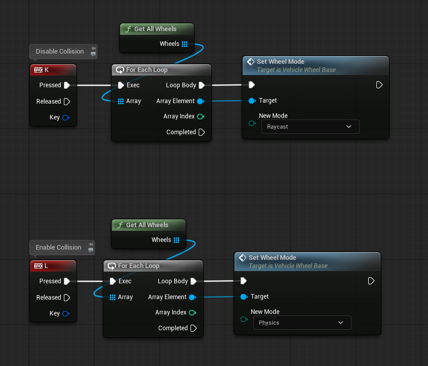
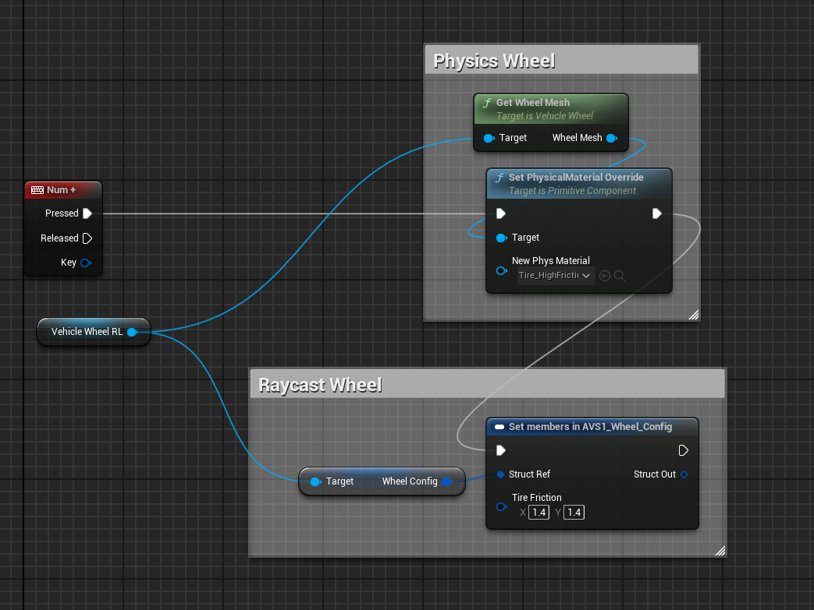
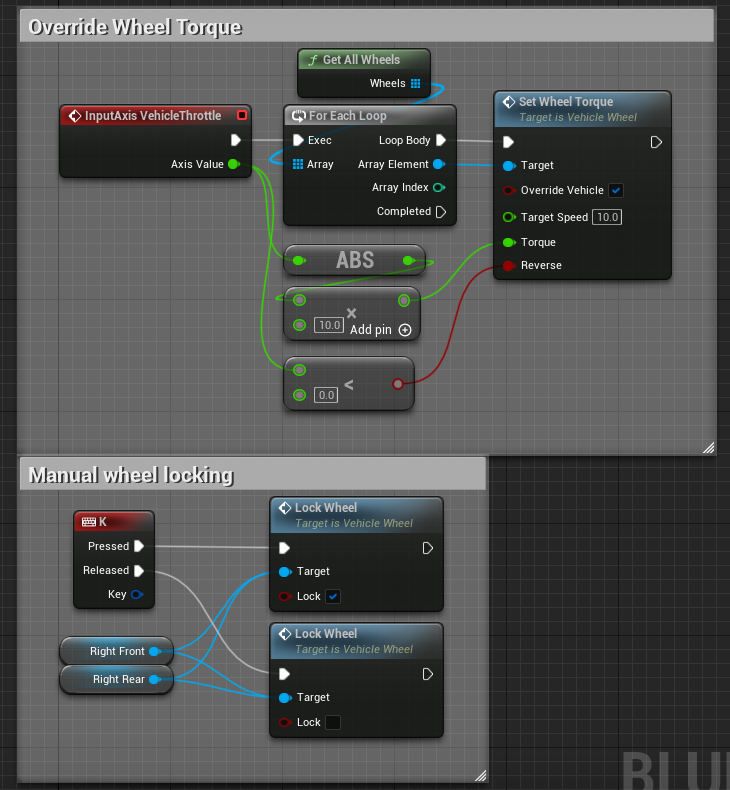

# Wheels at Runtime

How to change wheels while the game runs. Each section is one task.

Setting wheels up in the first place is covered on [Wheels](https://overtorque-creations.com/Dev/Docs/#AVS/Components/Wheels.md). Every wheel function is listed in [Wheel Settings](https://overtorque-creations.com/Dev/Docs/#AVS/Reference/Wheel_Settings.md).


## Detach or Remove

There are two ways to take a wheel away from a vehicle.

<!-- side-by-side:50 -->
**Detach**

`Detach()` takes the wheel off. It falls away as a loose physics body, but the component stays on the vehicle and the vehicle still knows about it.

Use it for damage: a crash knocking a wheel loose, a derby car losing its wheels, a jack lifting a wheel for repair.

`Attach()` puts it back.
<!-- split -->
**Remove**

`AddWheel()` **installs** a new wheel component 
`RemoveWheel()` **destroys** one, along with its mesh. 
Both then recompute the vehicle's wheel set.

This is for modular vehicles: Such as a truck gaining a third axle, or a configurator building vehicles from parts.

`RemoveWheel` is destructive. You cannot undo it, you would have to add a new wheel component and install it.
<!-- /side-by-side -->


## Detaching a Wheel

```cpp
if( UAVS_Wheel* Wheel = Vehicle->GetWheels()[WheelIndex] )
{
	Wheel->Detach();
}
```

Detaching clears the wheel's effects and refreshes the vehicle's contact handling, so there is nothing to clean up afterwards.

A detached wheel is a real physics body, even if it was a raycast wheel. Give the wheel mesh proper collision, or it falls through the world.

**Collide When Detached** (off by default) decides whether a loose wheel can hit the vehicle it came off.


## Attaching a Detached Wheel

```cpp
Wheel->Attach(/*ResetPosition*/ true, /*Force*/ true);
```

**ResetPosition** moves the wheel back to its place on the vehicle. **Force** rebuilds its constraints from scratch.


## Detaching and Resetting Every Wheel

`DetachAllWheels()` on the vehicle takes every wheel off at once. `ResetAllWheels()` moves every wheel back into position and reattaches any that were detached.

```cpp
// Every wheel comes off.
Vehicle->DetachAllWheels();

// Later, on respawn: every wheel goes back on.
Vehicle->ResetAllWheels();
```


## Disabling a Wheel Without Removing It

There is no disable setting. Detach the wheel, then turn off physics, collision and visibility on its wheel mesh. The component and its settings stay on the vehicle.

To bring it back, restore the mesh and call `Attach()`.


## Adding a Wheel at Runtime

`AddWheel` is protected, so call it from inside your vehicle Blueprint or a C++ subclass.

1. Create the `AVS_Wheel` component and attach it under the vehicle mesh. A wheel attached anywhere else is never found.
2. Set its settings: mode, roles, radius, suspension.
3. Call `AddWheel`. It sets the wheel up, creates its mesh, and adds it to the vehicle's wheel set.

```cpp
void AMyVehicle::AddSpareAxle()
{
	// Attach under the vehicle mesh. Wheels attached anywhere else are never found.
	UAVS_Wheel* NewWheel = NewObject<UAVS_Wheel>(this);
	NewWheel->SetupAttachment(VehicleMesh);
	NewWheel->RegisterComponent();
	NewWheel->SetRelativeLocation(FVector(-180.0f, 90.0f, 0.0f));

	// Configure it before installing.
	NewWheel->WheelStaticMesh = SpareWheelMesh;
	NewWheel->WheelConfig.WheelMode = EWheelMode::Raycast;
	NewWheel->WheelConfig.IsDrivingWheel = true;
	NewWheel->WheelConfig.IsBrakingWheel = true;

	AddWheel(NewWheel);
}
```

The change takes effect immediately, even while driving.


## Removing a Wheel at Runtime

`RemoveWheel` is protected, so call it from inside your vehicle Blueprint or a C++ subclass.

```cpp
void AMyVehicle::DropSpareAxle(UAVS_Wheel* Wheel)
{
	// Detaches the wheel, destroys its mesh and destroys the component.
	RemoveWheel(Wheel);
}
```

`RemoveWheel` destroys the component itself. Do not destroy it first.

Removing a driving wheel takes away that wheel's drive torque. Removing a wheel that is carrying weight drops that corner of the vehicle.


## Switching Wheel Mode at Runtime

Call `SetWheelMode` on each wheel. To switch the whole vehicle, loop `GetWheels`.



A physics wheel's collision is part of the simulation and cannot be turned off. Raycast wheels ignore wheel mesh collision completely. Switching to raycast mode is how you drive a vehicle with its wheel collision effectively disabled.


## Changing Tire Grip at Runtime

For raycast wheels, set **Tire Friction** on the wheel's **Wheel Config**. For physics wheels, swap the wheel mesh's physical material with `SetPhysMaterialOverride`.



Friction changed this way does not need replicating, as long as every machine calculates the same value. For example, from a curve based on speed.


## Changing a Wheel Mesh at Runtime

`ChangeStaticMesh(NewMesh)` swaps the wheel's mesh and reattaches the wheel. It also clears any material overrides on the old mesh.

With **Wheel Reprojection** on, the projected mesh is updated too.


## Driving One Wheel from Code

`SetWheelTorque` takes one wheel away from the gear table and drives it directly.

```cpp
// TargetSpeed is in cm/s. Torque is in hNm.
Wheel->SetWheelTorque(/*OverrideVehicle*/ true, /*TargetSpeed*/ 2000.0f, /*Torque*/ 30.0f, /*Reverse*/ false);
```

**OverrideVehicle** keeps your value. With it off, the vehicle's next torque update replaces it. Call it again with `false` to hand the wheel back to the gear table.




## Locking a Wheel

`LockWheel(true)` stops the wheel turning, and `LockWheel(false)` releases it. A physics wheel only locks while it is attached.

AVS also locks wheels on its own: handbrake wheels while the handbrake is applied, driving wheels while in Park, and braking wheels at low speed with the brake held. See [Wheel Settings](https://overtorque-creations.com/Dev/Docs/#AVS/Reference/Wheel_Settings.md).


## Moving a Wheel from Code

`SetWheelPosition(Location, Rotation)` moves the wheel relative to its parent. `ResetPosition()` puts it back.

Use it for a vehicle whose wheels move: an articulated frame, or a vehicle that changes shape. Keep every wheel on one AVS vehicle and move them each frame.
