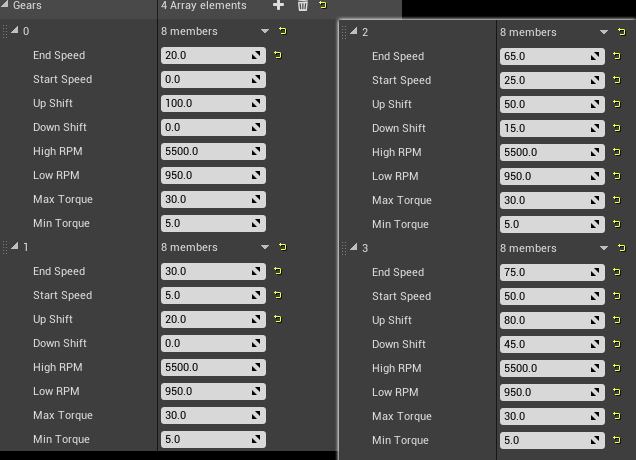

# Engine and Transmission

AVS does not simulate a full engine and drivetrain. Torque comes from the gear you are in, based on your current speed, and RPM is a cosmetic value derived from engine load and throttle.


## Basic Understanding

The transmission is a table of gears. Each gear covers a speed range and supplies an amount of torque across that range.

At any moment AVS looks at the vehicle's speed, finds the active gear, and interpolates between that gear's **Max Torque** at its **Start Speed** and its **Min Torque** at its **End Speed**. Past the End Speed, torque falls off exponentially, which is what limits the vehicle's top speed.

RPM is not part of that calculation. Each gear carries a **High RPM** and **Low RPM** value that AVS interpolates for audio and UI only.

This keeps setup to a table of numbers, and is enough to drive audio, HUDs, and shift behavior convincingly.


## Step 1: Set your Speed Units

**Speed Units** decides what every speed number on the vehicle means, including every value in the gear table.

> Changing **Speed Units** after building a table does not convert the numbers. Your gear speeds will silently mean something else. Pick the unit first.


## Step 2: Build the Gears Array

<!-- side-by-side:57 -->
**1. Decide the vehicle's top speed.** That is the **End Speed** of your last gear, in whatever unit **Speed Units** is set to.

**2. Work backwards.** Each gear's End Speed is roughly where the next one takes over. A four gear car topping out at 75 might run 30 / 50 / 65 / 75.

**3. Set Start Speed** to where the gear becomes useful — usually the previous gear's End Speed, or slightly below it so they overlap.

**4. Set shift points.** **Up Shift** is the speed the transmission changes up at, **Down Shift** the speed it changes back down.

**5. Set torque.** **Max Torque** applies at Start Speed, **Min Torque** at End Speed, interpolated between.
<!-- split -->

<!-- /side-by-side -->

> Leave a gap between **Up Shift** and **Down Shift**, or the transmission will hunt back and forth at the boundary.


## Gear Settings Reference

| Setting | Means |
|---|---|
| **End Speed** | Intended maximum speed of the gear. Torque is at Min Torque here, and falls off exponentially beyond it. |
| **Start Speed** | Intended minimum speed of the gear. Torque is at Max Torque here. |
| **Up Shift** | Automatic transmission only. Changes up when above this speed. |
| **Down Shift** | Automatic transmission only. Changes down when below this speed. |
| **High RPM** | Cosmetic. The RPM shown at End Speed. |
| **Low RPM** | Cosmetic. The RPM shown at Start Speed. |
| **Max Torque** | Torque at Start Speed, in hNm. |
| **Min Torque** | Torque at End Speed, in hNm. |


## Gear 0 is Always Reverse

The first entry in the Gears array is the reverse gear. Everything after it is a forward gear.

A four gear car therefore has five entries: gear 0 for reverse, then gears 1 to 4.


## Torque Units: Hectonewton Meters

Torque is in **hectonewton meters (hNm)**, equal to 100 Nm.

A value of `50` applies 5000 Nm at the wheel.


## High RPM and Low RPM are Cosmetic

**High RPM** and **Low RPM** produce an RPM value for audio and UI. They are not used in any physics calculation.

Set them to whatever sounds right for the vehicle.


## Example Gear Table

A working four gear starting point, with reverse in gear 0.

| | Gear 0 (reverse) | Gear 1 | Gear 2 | Gear 3 |
|---|---|---|---|---|
| End Speed | 20.0 | 30.0 | 65.0 | 75.0 |
| Start Speed | 0.0 | 5.0 | 25.0 | 50.0 |
| Up Shift | 100.0 | 20.0 | 50.0 | 80.0 |
| Down Shift | 0.0 | 0.0 | 15.0 | 45.0 |
| High RPM | 5500.0 | 5500.0 | 5500.0 | 5500.0 |
| Low RPM | 950.0 | 950.0 | 950.0 | 950.0 |
| Max Torque | 30.0 | 30.0 | 30.0 | 30.0 |
| Min Torque | 5.0 | 5.0 | 5.0 | 5.0 |

Reverse uses an Up Shift of `100.0` so the automatic transmission never tries to shift out of it.


## Shifter Position vs Current Gear

These are two separate things, and confusing them is the most common source of "my vehicle won't move".

<!-- side-by-side:50 -->
**The shifter** is the PRND position — Park, Reverse, Neutral, Drive. It is what the player controls.

`SetShifterInput` sets it directly. `MoveShifterInput(bMoveUp)` steps through positions, which is what you bind to shift up and shift down keys.

A vehicle spawns in **Park**. It will not move until something shifts it into Drive.
<!-- split -->
**The gear** is the entry in the Gears array currently supplying torque. With Automatic Transmission on, AVS picks it.

`GetSelectedGear` returns the gear chosen by input. `GetCurrentGear` returns the gear actually in use.

They differ during the shift delay. For a tachometer, read `GetCurrentGear` — it is what the engine is actually doing.
<!-- /side-by-side -->


## Transmission Modes: Automatic and Manual

<!-- side-by-side:50 -->
**Automatic with manual shifter** (the default)

**Automatic Transmission** on, **Automatic Shifter Positon** off. AVS picks gears; the player still moves the shifter between Drive and Reverse.

Suits driving sims and anything where reversing should be deliberate.
<!-- split -->
**Fully automatic**

Both on. The vehicle moves itself between Drive and Reverse based on input, so the player never shifts.

Suits arcade and casual driving. Requires the combined input function, covered below.
<!-- /side-by-side -->

For a manual transmission, turn **Automatic Transmission** off and drive gear selection yourself with `SetManualGear`.


## Gear Switch Time

**Gear Switch Time** (`0.5` s) is how long a gear change takes. During that window, `GetSelectedGear` and `GetCurrentGear` disagree.

Enable **Zero Throttle While Shifting** under Engine to cut throttle during the change.


## Automatic Shifter Position Setup

**Automatic Shifter Positon** needs a specific input arrangement, and it will not work without it.

1. In project input settings, remove the separate brake axis. Add your brake keys to the throttle axis with a scale of `-1.0`, so one axis carries both.
2. In the event graph, replace `SetThrottleInput` with **`SetThrottleAndBrakeInput`**, fed from that axis.

Negative values then act as brake while moving forward, and as throttle once the vehicle is in reverse.

Full walkthrough with screenshots in the [Quick Start guide](https://overtorque-creations.com/Dev/Docs/#AVS/Getting_Started/Quick_Start.md).


## Starting and Stopping the Engine

<!-- side-by-side:57 -->
A vehicle spawns with the engine off and in Park. Handle both, or nothing happens when the player presses a key.

The simplest approach is **Start With Engine Running** on, and shifting into Drive on BeginPlay. That is what the Quick Start does, and it is enough for a prototype.

For anything with an ignition, leave it off and call `StartEngine` — a convenience for `SetEngineRunning(true)`.

`SetEngineRunning` is replicated, so call it from the owning client or the server. `SetLocalEngineRunning` exists for local-only cosmetic cases.
<!-- split -->

<!-- /side-by-side -->


## Ignition Time

**Ignition Time** (`0.5` s) is the delay between `StartEngine` and the engine actually running.

This is the window your starter sound plays into.


## Idle RPM and Idle Max RPM

**Idle RPM** (`1000`) and **Idle Max RPM** (`7500`) set the RPM range in neutral, from no throttle to full throttle.

These feed engine audio when the vehicle is not moving.


## GearChanged and ShifterChanged Events

**GearChanged** fires with the old and new gear index. 
**ShifterChanged** fires when the PRND position moves.

Both are Blueprint events, and both are overridable in C++.

These are where shift audio, dash indicators, and transmission animation belong — rather than polling the current gear on Tick and comparing it to last frame.


## Changing the Gears Array at Runtime

- `SetGearArray` replaces the whole table.
- `SetGearItem` replaces a single gear by index.

Useful for a vehicle that gets an upgrade, or a configurator swapping transmissions.

Both take effect immediately, so avoid replacing the table mid-shift.

```cpp
TArray<FVehicleGear> NewGears;

FVehicleGear Reverse;
Reverse.StartSpeed = 0.0f;
Reverse.EndSpeed   = 20.0f;
Reverse.UpShift    = 100.0f;
Reverse.MaxTorque  = 30.0f;  // [hNm] 30 = 3000 Nm at the wheel
Reverse.MinTorque  = 5.0f;
NewGears.Add(Reverse);

FVehicleGear First;
First.StartSpeed = 5.0f;
First.EndSpeed   = 30.0f;
First.UpShift    = 20.0f;
First.DownShift  = 0.0f;
First.MaxTorque  = 30.0f;
First.MinTorque  = 5.0f;
NewGears.Add(First);

// Replaces the whole table. Gear 0 is always reverse.
Vehicle->SetGearArray(NewGears);
```
