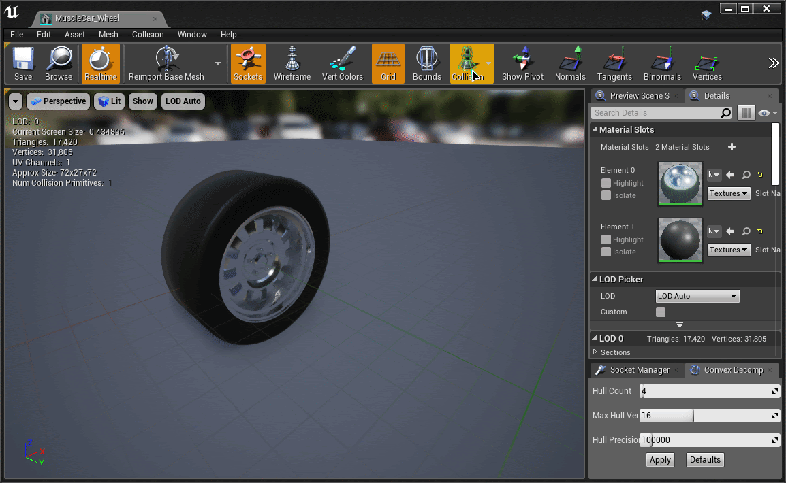
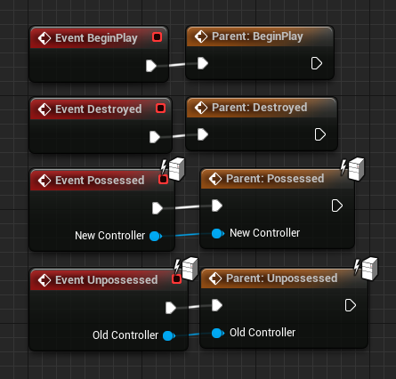
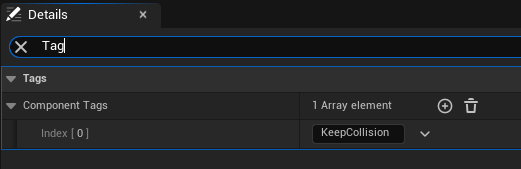
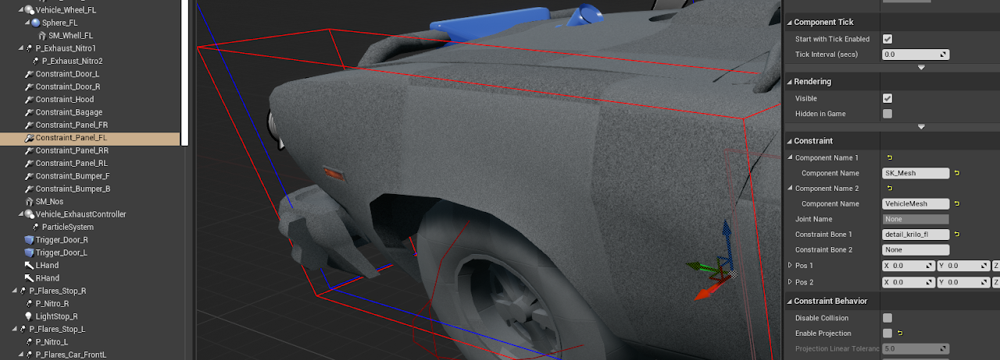

# Important Information

## Wheel Mesh Collisions

<!-- side-by-side:48 -->
When using **Physics Wheels** (not Raycast Wheels), you must pay careful attention to the shape of the collision on your wheel mesh. AVS supports any collision shape, but **for best results—especially at high speeds—you should use a simple sphere collision.**

Unreal Engine does **not** support true cylinder collisions in Chaos.

Faking a cylinder using convex collision may _look_ correct, but it will not behave correctly—these approximated shapes are not perfectly round, and they will cause the wheels to bounce or behave erratically when driving fast.

While unconventional setups are allowed, **a sphere is the most stable and recommended option** for typical vehicles using physics-based wheels.

**Raycast Wheels are not affected by this limitation**. You can use any collision shape for them, since the collision shape does not influence their simulation behavior.
<!-- split -->

<!-- /side-by-side -->

## Blueprint events

<!-- side-by-side:57 -->
In order to ensure proper functionality, you must call the "parent" function for the following blueprint events. You can do so by right clicking the event, and selecting "Add Call to Parent Function".

- Construction Script
- Event BeginPlay
- Event Destroyed
- Event OnPossessed
- Event Unpossessed
<!-- split -->

<!-- /side-by-side -->

## Skeletal Mesh Collisions Are Disabled by Default

<!-- side-by-side:57 -->
When you attach a **Skeletal Mesh** to the VehicleMesh component, **AVS will automatically disable its collisions** during construction. This is intentional.

Skeletal meshes cannot weld to the root physics body, and leaving their collisions enabled can lead to unexpected or unstable physics behavior. Since skeletal meshes are typically used for **visual/cosmetic purposes only**, disabling their collision helps prevent these issues and improves performance.

If you **do** want a specific skeletal mesh to keep its collisions active, just add the **KeepCollision** tag to that mesh in the editor. AVS will skip disabling collision for any mesh with that tag.
<!-- split -->

<!-- /side-by-side -->

## Avoid Physics Constraints in Skeletal Mesh Physics Assets

<!-- side-by-side:48 -->
If you're using a **Skeletal Mesh** as part of your vehicle setup and need to add **physics constraints**, do **not** place those constraints inside the mesh's Physics Asset—especially if they rely on the skeletal mesh's root body.

Instead, create all such constraints **directly in the vehicle blueprint**, and connect them to the **VehicleMesh** component (the AVS root). This avoids a class of difficult-to-debug issues where constraints behave erratically—typically showing stuttery or jittery motion in parts of the mesh that are meant to simulate.

This behavior stems from how Unreal updates transforms for components that aren't welded to the root. Constraints defined inside skeletal mesh assets may receive outdated transform data, especially when mixing simulated and non-simulated bodies. The result is **inconsistent, unstable physics behavior**, usually visible as violent jittering of constrained parts.

To prevent this entirely, set up all physics constraints externally in your vehicle blueprint where they can reference the true root of the simulation.

A demonstration of this issue can be seen in the video to the right.
<!-- split -->

[Video: constraint jitter caused by constraints defined inside the Physics Asset](https://drive.google.com/file/d/1qQbSTNSwgUVjdT_krVEZ9wILCqH5RnGQ/preview)
<!-- /side-by-side -->
