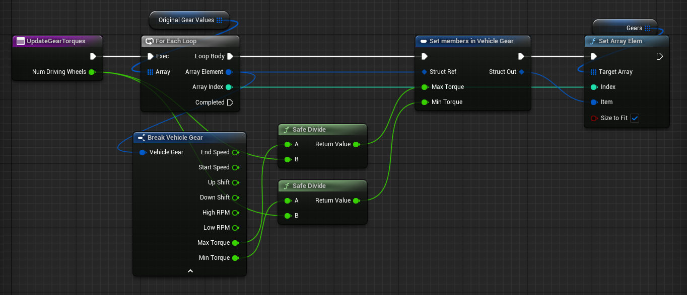

# Distributing Gear Torque Across Driving Wheels

The gear table's **Max Torque** and **Min Torque** are applied at each driving wheel, not at the drivetrain. Two driven wheels produce twice the torque of one, from the same table.

This page covers dividing that torque across the driving wheels, so the gear table reads as total drivetrain torque instead. Skip it unless you need it — a vehicle with a fixed wheel count can simply be tuned as it is.

## When You Need This

**The driving wheel count changes at runtime.** A vehicle switching between two and four wheel drive doubles its torque on the switch unless something divides it.

**You build vehicles from parts.** A configurator that adds a driven axle would otherwise make the vehicle accelerate harder for it.

**You want the table to mean drivetrain torque.** Authoring one number for the vehicle is easier to reason about than one number per wheel, particularly when the same table is shared between vehicles with different layouts.

## Dividing the Table by the Driving Wheel Count

1. **Keep an untouched copy of your gear array** — the values as you authored them. The division has to run against the original each time, or repeated runs compound.
2. **Build a function** that loops that copy, divides each gear's **Max Torque** and **Min Torque** by the current driving wheel count, and writes the result back with `SetGearItem` or `SetGearArray`.
3. **Run it whenever the driving wheel count changes**, including once at startup.

> Use a safe divide. A vehicle with no driving wheels would otherwise divide by zero.

With that in place, the gear table is total drivetrain torque, and adding or removing a driven wheel redistributes it rather than adding more.

## Uneven Splits

Dividing equally is the simple case. An uneven split — more torque to the rear axle than the front — needs one of two other approaches.

`SetWheelTorque` on a wheel drives that wheel directly, and is the simpler of the two. See [Wheels](https://overtorque-creations.com/Dev/Docs/#AVS/Components/Wheels.md).

Overriding the drivetrain gives you the whole distribution step, per substep, on the physics thread. That is a C++ path. See [Drivetrain and Physics Overrides](https://overtorque-creations.com/Dev/Docs/#AVS/Advanced/Physics_Overrides.md).
