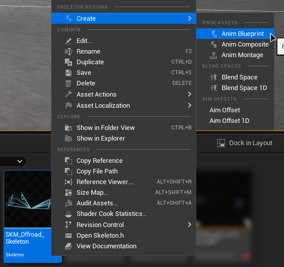
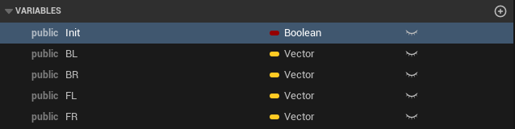
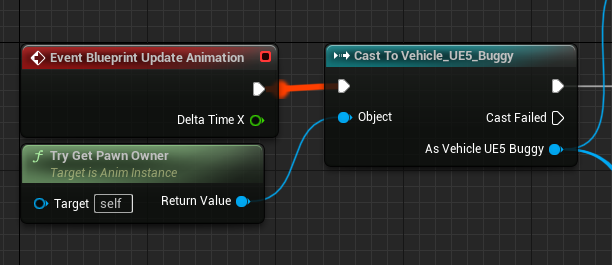
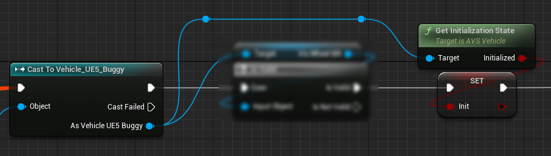
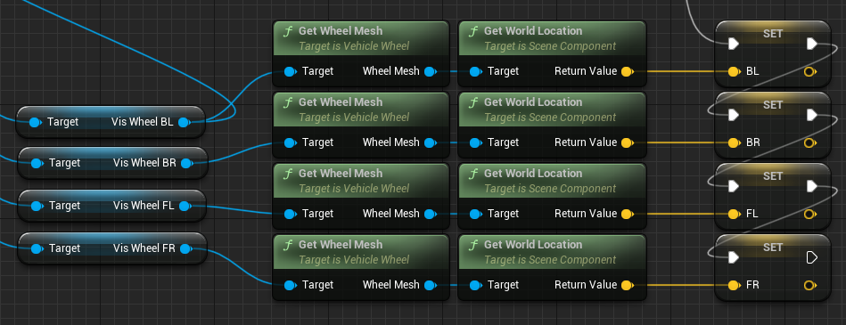
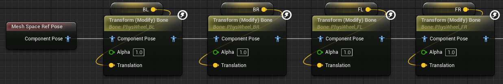
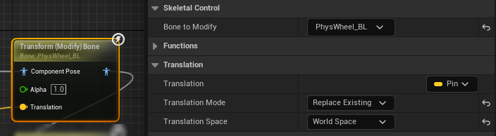
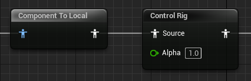
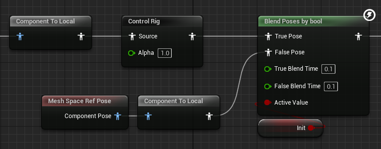

# Skeletal Mesh AnimBP

This page provides information on how to input wheel data from AVS into your AnimBP, using the UE5 Template Offroad Car as an example. If you are using the "Connect to Bone" feature of AVS you will need the [Skeletal Wheels](https://overtorque-creations.com/Dev/Docs/#AVS/Skeletal_Mesh/Skeletal_Wheels.md) page instead.

## Step 1: Create Your AnimBP

<!-- side-by-side:57 -->
Create a new AnimBP using the skeletion you wish to animate
<!-- split -->

<!-- /side-by-side -->

## Step 2: Setting up the Event Graph

Select the Event Graph tab inside your new AnimBP

<!-- side-by-side:41 -->

<!-- split -->
### 2A - Variables

Create variables for each wheel you need data from
<!-- /side-by-side -->

<!-- side-by-side:41 -->

<!-- split -->
### 2B - Cast to Actor

Cast to your Vehicle Actor
<!-- /side-by-side -->

<!-- side-by-side:41 -->

<!-- split -->
### 2C - Validate a wheel component

After casting, you need to validate one of your wheel components. This is because during construction the actor cast will pass, but the components have not been constructed yet, meaning a single frame will give errors if we attempt to read data from our wheel components. The validate step will prevent the event graph from continuing if the wheels have not been constructed yet.
<!-- /side-by-side -->

<!-- side-by-side:58 -->

<!-- split -->
### 2D - Save vehicle initalization state

Next we will save the initialization state, we will use this later to prevent the graph from animating pre-runtime.
<!-- /side-by-side -->

<!-- side-by-side:58 -->

<!-- split -->
### 2E - Save data from wheels

Now that we have access to the wheels. You can save whatever data you need from them for your Anim Graph
<!-- /side-by-side -->

The finished event graph:

## Step 3: Setting up the Anim Graph

Select the Anim Graph tab inside your new AnimBP

<!-- side-by-side:58 -->

<!-- split -->
### 3A - Transform Wheel Bones

Transform each of your bones as needed. Here we will be setting the bone location in world space, make sure to set the transform node's settings accordingly.
<!-- /side-by-side -->

<!-- side-by-side:41 -->

<!-- split -->
### 3B - Offroad Control Rig

If your following along using the UE5 template offroad car, or if you have a control rig. You will want to add the control rig here. I used the offroad control rig unmodified.
<!-- /side-by-side -->

<!-- side-by-side:58 -->

<!-- split -->
### 3C - Only animate on Init

Now we want to prevent the anim graph from running unless the vehicle has passed initialization. We do this to ensure the mesh is in the default pose during initialization, or in the editor. This can be useful if we want to snap wheels to the bone location, for example, which is how the offroad car is setup in the AVS demo.
<!-- /side-by-side -->

The finished anim graph:

## Step 4: Test

Set the AnimBP on your skeletal mesh inside your vehicle bp, if everything is setup correctly, your vehicle should now animate during play.

