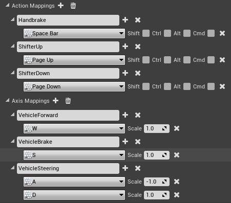
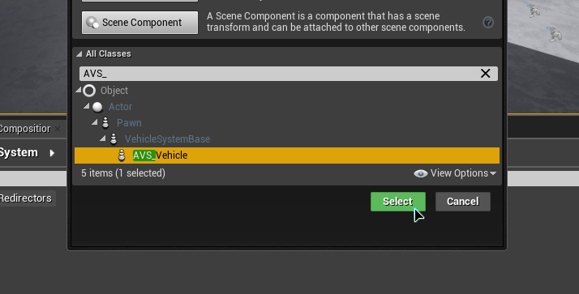
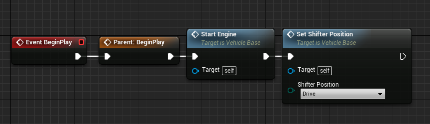
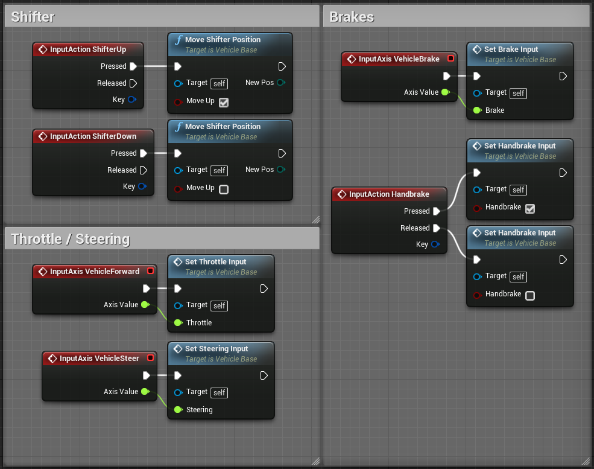
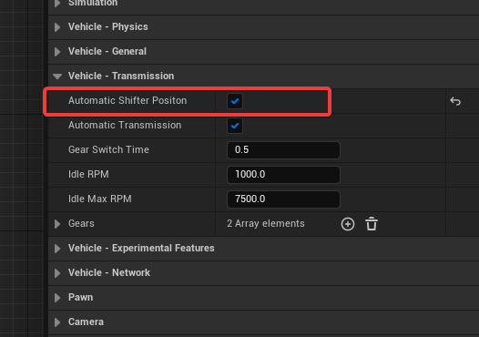
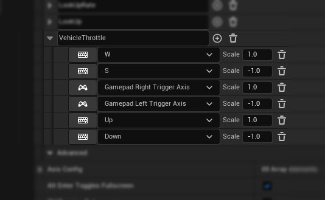
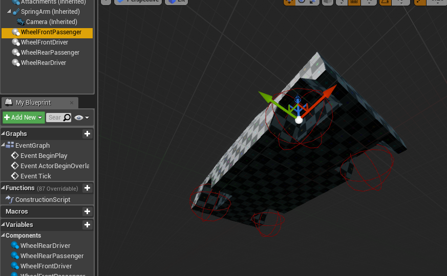
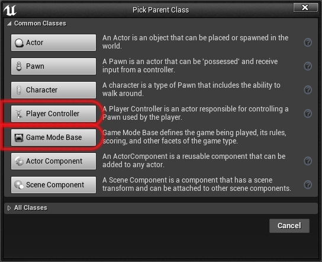
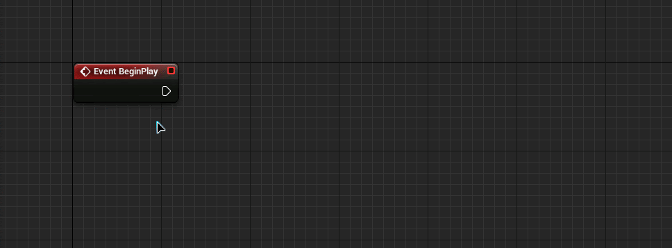
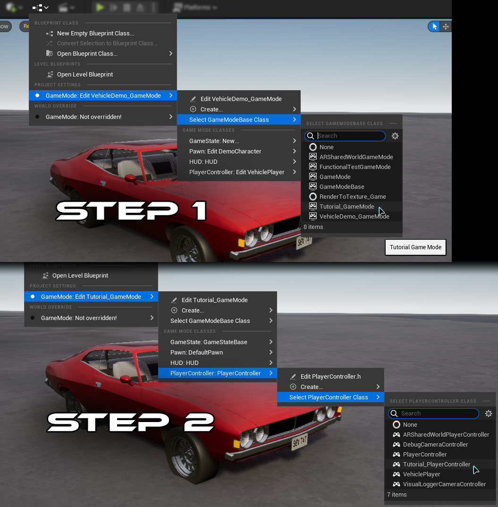

# Vehicle Quick Start Guide

## Download

A simple template is available here. It is still recommended to follow the tutorial if this is your first time setting up a vehicle, in order to understand the workings of the plugin.

[AVS Template v2 (UE5.2+) Download](https://drive.google.com/file/d/1EoGBkDWFwpZS5OzPvTGfFD1YEx8MsbHG/view?usp=sharing)

[Full Demo Source Code (As shown in marketing materials)](https://avs.overtorque-creations.com/download-demo)

## Requirements

- **A Static Mesh or Skeletal Mesh for the chassis and wheels of a vehicle**
  - Static Meshes will need a separate wheel mesh (A basic static mesh body and wheel are included in the plugin for demo purposes, you must check "Show Plugin Content" in the view options to see it)
  - Skeletal Meshes should be setup for or similar to Unreal's _WheeledVehicle_ system
- **Own the Advanced Vehicle System Plugin**
- **A basic understanding of Unreal Engine, some steps in this tutorial will expect you to know how to create or set up things without guidance**

**[If you are using a version of Unreal older than 5.2, click here for the legacy documentation](https://overtorque-creations.com/Dev/Docs/#AVS/Tutorials/Quick_Start_Pre_UE5.2.md)**

## Step 0: Optional - Configure Project Settings

Consider making the recommended changes from the [Project Settings page](https://overtorque-creations.com/Dev/Docs/#AVS/General/Project_Settings.md), they will dramatically increase physics stability, and top speed in the physics wheel mode.

## Step 1: Configure your Inputs

<!-- side-by-side:41 -->

<!-- split -->
Before we can setup the vehicle, we need to know what our inputs are. So head into your Project Settings > Input and set up something similar to this image.
<!-- /side-by-side -->

## Step 2: Create the Base Vehicle

<!-- side-by-side:50 -->

<!-- split -->
**2A**

Create a new blueprint and choose the base class "AVS_Vehicle" as the parent class.

It is recommended to name this blueprint "ProjectName_Vehicle" to facilitate sharing code, settings, and components among all vehicles in your project.

**2B**

- Open the newly created vehicle blueprint.
- Within the Blueprint Editor, locate the "Components" section and add a "SpringArm" component to the blueprint.
- Next, attach a camera to the "SpringArm" component. This camera will serve as the viewpoint for the vehicle.
- As this tutorial won't cover camera input setup, consider rotating the "SpringArm" slightly to the side. This adjustment will allow you to view the vehicle's wheels as you drive it.
<!-- /side-by-side -->

<!-- side-by-side:48 -->
**2C**

Open the Event Graph.

By default, the vehicle is not running and in park. For simplicity, we will start the engine and shift into drive on BeginPlay so the vehicle is ready to drive later when we press play.
<!-- split -->

<!-- /side-by-side -->

<!-- side-by-side:48 -->
**2D**

While we are in the event graph, we'll also setup the vehicle inputs.
<!-- split -->

<!-- /side-by-side -->

### (Optional) Set up Automatic Shifting

<!-- side-by-side:50 -->

<!-- split -->
AVS 1.2.5 added an additional option for automatic shifter positions. If you would like to use this feature you will need to slightly change the configuration above.
<!-- /side-by-side -->

<!-- side-by-side:46 -->
- Open your project input settings and remove the VehicleBrake input. Open your VehicleForward input and add your brake keys with a value of ( -1.0 )
<!-- split -->

<!-- /side-by-side -->

<!-- side-by-side:46 -->
- In your event graph from step 2, remove the old brake input. Replace the 'SetThrottleInput' node with the new 'SetThrottleAndBrakeInput' node. This node is required for Automatic Shifting to function correctly.
<!-- split -->

<!-- /side-by-side -->

## Step 3: Creating a Vehicle

<!-- side-by-side:32 -->

<!-- split -->
**3A**

Right click on your base vehicle blueprint and select "Create Child Blueprint Class", this will be your actual vehicle so you can name it accordingly. For the tutorial I will name mine "Car".

**3B**

Open your new vehicle blueprint, then select the VehicleMesh component from the list and set it to your desired mesh. AVS comes with a placeholder mesh in it's content.

_Note: (If the plugin is installed to the engine) you'll have to check "Show Engine Content" in the content drawer in order to view the plugin content. (If the plugin is installed to the project) you'll have to check "Show Plugin Content" in the content drawer in order to view the plugin content._
<!-- /side-by-side -->

<!-- side-by-side:48 -->
**3C**

Wheels in AVS are separate components called "Vehicle_Wheel". Each wheel component holds the data for the wheel its representing, so you can configure every wheel individually.

You'll need to add one for each wheel you need on the vehicle. Then reposition each component to its appropriate location on the vehicle.

For better productivity and organization, it is advisable to name the components based on their specific locations on the vehicle.
<!-- split -->

<!-- /side-by-side -->

<!-- side-by-side:57 -->
**3D**

Now you'll want to configure your wheel components.

Select one of your wheels from the details panel.

Open the "Wheel Config" section.

**Wheel Static Mesh:**

- You have the option to choose a specific wheel mesh if you have one available. If no mesh is selected, the system will use a sphere collision with the specified wheel radius size as a default.
- In "Raycast" wheel mode, the selected mesh's collision does not affect the behavior, unless you plan to use the "detach wheel" feature.
- In "Physics" wheel mode, the wheel will inherit collision properties from the selected wheel mesh. For regular wheels it is recommended to use a simple sphere collision, as convex collisions do not roll smoothly at speed.

**Drive/Steer:**

- In this section, configure each wheel as a driving or steering wheel, depending on its location and your desired vehicle setup.
- Keep in mind that torque may need to be inverted for wheels that are flipped 180 degrees.
- For steering wheels located at the rear of the vehicle, you might need to invert the steering configuration.
<!-- split -->

<!-- /side-by-side -->

## Step 4: Configure your Vehicle

**4A**

Select ClassName(self) in the components list or press the "Class Defaults" button, you will notice in the details panel there are categories Prefixed "Vehicle -". These are where you configure values related to the vehicle as a whole. For now we just want to edit the transmission values, so open "Vehicle - Transmission".

<!-- side-by-side:48 -->
**4B**

In the "Gears" section you will see there are 2 gears by default. Gear 0 will always be the reverse gear, and then everything after is a forward gear.

Add 2 more gears, then configure them similar to the following image.
<!-- split -->

<!-- /side-by-side -->

| | Gear 0 (reverse) | Gear 1 | Gear 2 | Gear 3 |
|---|---|---|---|---|
| End Speed | 20.0 | 30.0 | 65.0 | 75.0 |
| Start Speed | 0.0 | 5.0 | 25.0 | 50.0 |
| Up Shift | 100.0 | 20.0 | 50.0 | 80.0 |
| Down Shift | 0.0 | 0.0 | 15.0 | 45.0 |
| High RPM | 5500.0 | 5500.0 | 5500.0 | 5500.0 |
| Low RPM | 950.0 | 950.0 | 950.0 | 950.0 |
| Max Torque | 30.0 | 30.0 | 30.0 | 30.0 |
| Min Torque | 5.0 | 5.0 | 5.0 | 5.0 |

### Explanation of Gear Variables

**End Speed** — Intended maximum speed of this gear. Torque will be at MinTorque at this speed, and will decrease exponentially beyond this speed. The unit of speed is determined by the SpeedUnit setting in the vehicle

**Start Speed** — Intended minimum speed of this gear. Torque will be at MaxTorque at this speed, and will interpolate between MaxTorque and MinTorque between this speed and EndSpeed. The unit of speed is determined by the SpeedUnit setting in the vehicle

**Up/Down Shift** — Speed at which the transmission will choose a new gear

**Min/Max Torque** — The torque values used to be arbitrary, they were roughly based on the values used by the physics constraint motors in UE4. In AVS 1.4 that changed and it now represents (Nm * 0.01), or **hectonewton meter (hNm)**. So a value of 50 equals 5000 Nm applied at the wheel.

**Low/High RPM** — Right now, RPM values are purely cosmetic, since there is not a true engine sim happening under the hood (yet!). For now, these values simply fake a value by guessing from the current engine load and throttle values, so that we have something to plug into cosmetic components such as engine audio.

## Step 5: Setup the config assist HUD

_The plugin includes a basic HUD to assist in the creation of vehicles. This step is not required but is recommended if you are not extremely familiar with Unreal Engine._

<!-- side-by-side:48 -->
**5A**

Create both a player controller blueprint and a game mode blueprint.
<!-- split -->

<!-- /side-by-side -->

<!-- side-by-side:48 -->
**5B**

Open the new player controller, drag off the execution pin on Event Begin Play. Then type "Create Widget" in the box, and press Enter. Set the new Create widget node to the VehicleSetup HUD. Then grab the return value and use it to create the "Add to Viewport" Node. Lastly set the owning player to Self.

_Note: (If the plugin is installed to the engine) you'll have to check "Show Engine Content" in the content drawer in order to view the plugin content. (If the plugin is installed to the project) you'll have to check "Show Plugin Content" in the content drawer in order to view the plugin content._
<!-- split -->

<!-- /side-by-side -->

<!-- side-by-side:40 -->
If you need multiplayer, add a check to see if we are on the local controller.
<!-- split -->

<!-- /side-by-side -->

<!-- side-by-side:40 -->
**5C**

Now open your level, and click the blueprints button. You need to set your gamemode to the one you created, and then set your PlayerController within that game mode.
<!-- split -->

<!-- /side-by-side -->

## Step 6: Test what you have so far

If you have successfully followed along, you should now be able to drive your vehicle. Either **set the default pawn in your GameMode** to your new vehicle, or **place one in your level and set "Auto Possess Player 0" in the details panel.**

Once you are in the game, you can use your ShiftUp and ShiftDown inputs to move the shifter (PRND not gears), you will see it change on the HUD. However if you're using the "Automatic Shifter Position" feature this will happen automatically.

If you want to use the buttons and sliders, press **'SHIFT + F1'** to bring your mouse cursor up. You can also use the HUD to play with different values for your springs and find the best values. The new springs values will be applied to every wheel, overriding whatever you had set before.

