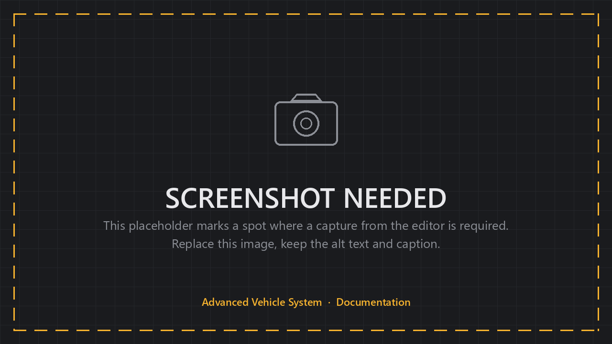

# Custom Wheel Effects

Every wheel effect is a subclass of `AVS_WheelEffect`, in Blueprint or C++.
The built-in effects use the same functions available to your own.


## Basic Understanding

An effect has four lifecycle functions and one job: read the wheel, decide whether it should be running, calculate a 0-1 intensity, and drive an output with it.

Most effects use `FAVS_WheelEffectOutput` for that output, which is the same audio and particle block the built-in effects expose. Writing your own output is possible but rarely necessary.

`BrakeSqueal` ships as an example of the exception. It does not use the standard output block, and implements its own audio-only output instead.


## Creating a Custom Effect Class

<!-- side-by-side:57 -->
**1. Create the class.** In Blueprint, a new Blueprint class with `AVS_WheelEffect` as the parent. In C++, inherit from `UAVS_WheelEffect`.

**2. Add your condition properties** — the thresholds that decide when the effect runs. Look at how the built-in effects expose a min and full range; users will expect that shape.

**3. Add an output.** Use `FAVS_WheelEffectOutput` unless you need something it cannot express.

**4. Implement Tick Effect** — read the wheel, calculate a 0-1 intensity, drive the output.

**5. Implement Clear Effect** to release what you spawned.

**6. Add it to the effects array** on a vehicle. Your class appears alongside the built-in ones.
<!-- split -->

<!-- /side-by-side -->


## Effect Lifecycle Functions

| Function | When it runs | What belongs there |
|---|---|---|
| **Requirements Met** | Before creation | Return false to skip this effect entirely |
| **Init Effect** | Once, on creation | Setup. The effect's BeginPlay. |
| **Tick Effect** | Every tick from the wheel | Calculate intensity, drive output |
| **Clear Effect** | On contact or surface change | Release references to running audio and particles |

All four receive the owning `AVS_Wheel`.


## Using Requirements Met

Use **Requirements Met** instead of checking inside Tick.

Return false when the effect does not apply to this wheel — no sound assigned, or a driving-wheel-only effect on an undriven wheel — and the effect is never created.


## Implementing Clear Effect

The symptom of getting this wrong is smoke that disappears mid-air instead of fading out.

<!-- side-by-side:57 -->
Clear Effect should **release your references, not destroy what is playing.**

The built-in pattern: spawn particles with auto-destroy enabled, then simply deactivate them here. The system stops emitting and destroys itself once the remaining particles finish their lives, so you get a natural fade.

Destroying the component removes every particle instantly, including ones already in flight. On a vehicle leaving a skid, the smoke disappears mid-air.

Same principle for audio — fade it out and let it release, rather than stopping it dead.
<!-- split -->

<!-- /side-by-side -->


## Reading Wheel State in an Effect

What effects most often use, and what each is good for:

| Value | Drives |
|---|---|
| **Slip** / **Slip2D** | Skid, wheelspin, traction effects. X is longitudinal, Y is lateral. |
| **Suspension Force** | Load-sensitive effects — heavier landings, weight transfer |
| **Contact Normal Speed** | Impact strength |
| `GetContactSurfaceType` | Surface-dependent behavior inside a single effect |
| `GetRotationSpeed` | Wheel surface speed |
| `GetCurrentBrakingTorque` | Brake-driven effects |


## Contact Helpers on the Effect Base Class

Two convenience functions save you tracking state yourself:

- `GetContactStartedThisFrame` — true during the frame the wheel regained contact. This is how you fire a one-shot on landing.
- `GetContactImpactSpeed` — the strongest completed or currently forming contact-normal impact, in cm/s.


## Using FAVS_WheelEffectOutput

If your effect suits normal audio and particle output, add an `FAVS_WheelEffectOutput` property and drive it with the protected helpers:

| Helper | Does |
|---|---|
| `StartOutput(Output, Intensity, bContinuous)` | Spawns and starts audio and particles |
| `UpdateOutput(Output, Intensity)` | Updates intensity on what is running |
| `StopOutput()` | Stops current output |
| `IsOutputActive()` | Whether output is running |
| `GetOutputTransform(Output)` | Resolves placement settings to a world transform |

`bContinuous` is the difference between a looping effect like a skid and a one-shot like a bump.

Prefer this over a custom output. Anyone configuring your effect then gets the same placement, intensity range, audio, and particle settings used by the built-in effects.


## Example: A Minimal C++ Effect

A complete effect that plays a sound and a Niagara system when a wheel's lateral slip passes a threshold.

```cpp
UCLASS(BlueprintType, Blueprintable, EditInlineNew, DefaultToInstanced, meta=(DisplayName="Lateral Slip"))
class ULateralSlipEffect : public UAVS_WheelEffect
{
	GENERATED_BODY()

public:
	// Slip where the effect starts, and where it reaches full intensity.
	UPROPERTY(EditAnywhere, BlueprintReadWrite, Category="Conditions", meta=(ClampMin="0.0"))
	float MinSlip = 0.5f;

	UPROPERTY(EditAnywhere, BlueprintReadWrite, Category="Conditions", meta=(ClampMin="0.0"))
	float FullSlip = 1.5f;

	// Standard audio + particle output, so users get the settings they already know.
	UPROPERTY(EditAnywhere, BlueprintReadWrite, Category="", meta=(ShowOnlyInnerProperties))
	FAVS_WheelEffectOutput Output;

	virtual bool RequirementsMet_Implementation(UAVS_Wheel* Wheel) override;
	virtual void TickEffect_Implementation(UAVS_Wheel* Wheel, float DeltaTime) override;
	virtual void ClearEffect_Implementation(UAVS_Wheel* Wheel) override;
};
```

```cpp
bool ULateralSlipEffect::RequirementsMet_Implementation(UAVS_Wheel* Wheel)
{
	// No assets assigned means there is nothing to play, so never create the effect.
	return IsValid(Output.Sound) || IsValid(Output.NiagaraSystem);
}

void ULateralSlipEffect::TickEffect_Implementation(UAVS_Wheel* Wheel, float DeltaTime)
{
	if( !IsValid(Wheel) || !Wheel->GetHasContact() )
	{
		StopOutput();
		return;
	}

	const float LateralSlip = FMath::Abs(Wheel->WheelData.Slip2D.Y);
	if( LateralSlip < MinSlip )
	{
		StopOutput();
		return;
	}

	const float Intensity = FMath::Clamp(FMath::GetRangePct(MinSlip, FullSlip, LateralSlip), 0.0f, 1.0f);

	if( IsOutputActive() ) UpdateOutput(Output, Intensity);
	else StartOutput(Output, Intensity, true); // true = continuous
}

void ULateralSlipEffect::ClearEffect_Implementation(UAVS_Wheel* Wheel)
{
	// Releases the running output. Anything spawned with auto-destroy finishes on its own.
	StopOutput();
}
```

The Blueprint version is the same four events with the same logic. `StartOutput`, `UpdateOutput` and `StopOutput` are available there too.


## Effect State and Runtime Instances

<!-- side-by-side:57 -->
Configured effects are **templates**. Each wheel duplicates them into its own transient runtime instance.

That is why every effect can safely hold state — a smoothed value, a cooldown timer, a spawned component reference — without wheels interfering with each other.

In C++, mark such properties `Transient` and `DuplicateTransient`. In Blueprint, simply do not expect editor-set values on state variables to survive duplication.
<!-- split -->

<!-- /side-by-side -->


## Where State Survives: Surface vs Global Effects

**Surface effects are recreated** when contact or surface changes, so their state resets with them.

**Global effects persist** and keep their state for the lifetime of the wheel.

That distinction decides where your effect belongs. A cooldown that should survive driving from tarmac onto dirt needs to be global; a smoothed slip value that should reset on a new surface is fine as a surface effect.
