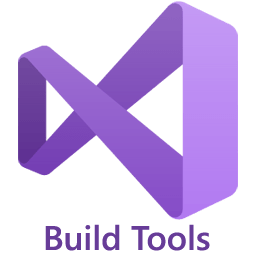
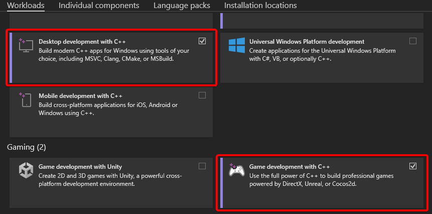

# C++ Compilation Instructions

## **C++ Compilation Instructions**

The project contains C++ code, and therefore requires you to have a C++ compiler installed.**Choose and Download a compiler below**

- Choose_**BuildTools**_if you just want the** minimal installation** in order to compile C++ code
- Choose_**Visual Studio**_if you also want Microsoft's C++ IDE (Code Editor Program)

Download BuildTools 2022

Download Visual Studio 2022

**How to Compile**

1. Choose and download an Installer from above

2._**Workloads Tab**_: Check** desktop development with C++**--If using Visual Studio also check **Game development with C++**

3._**Individual Tab**_: Check the**.NET Runtime** for your respective Unreal version and**.NET Framework 4.8 targeting pack**

- Unreal 5.4+ uses**.NET 8.0 Runtime**
- Previous versions use**.NET 6.0 Runtime**

4. Install the selected components

5. Launch your **ProjectName**.uproject** andcompilation should begin

