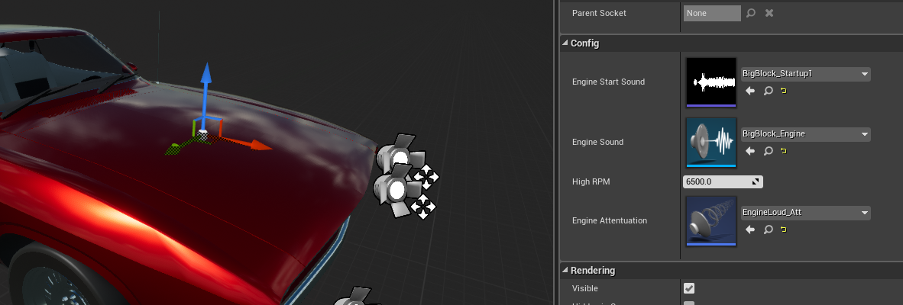
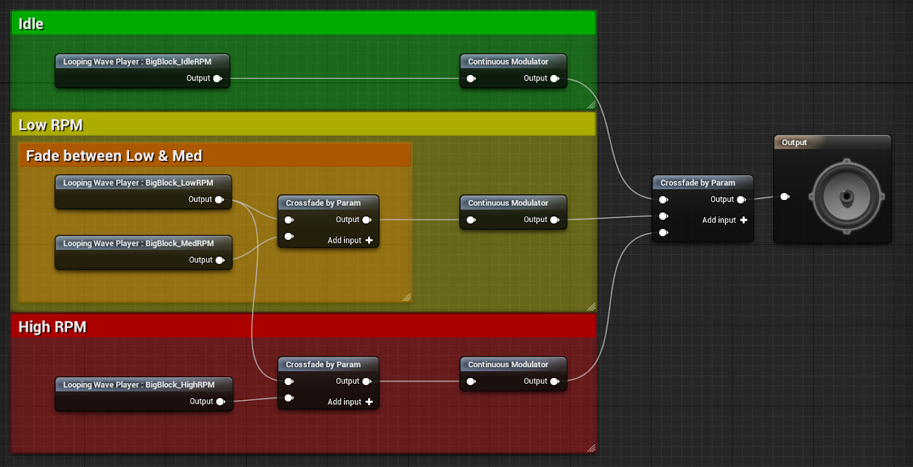

# Engine Audio

## Setting up Engine Sounds for your Vehicle

<!-- side-by-side:32 -->
The Vehicle System includes the _Vehicle_EngineAudio_ component as an optional feature for quick vehicle setups. To use it add the component to your vehicle and position it where the audio source should be.
<!-- split -->

<!-- /side-by-side -->

### Configuration

**Engine Start Sound** is a simple audio file, it will be blended into the Engine Sound Loop.

**Engine Sound** is a looping Sound Cue that takes in 2 parameters, _RPM_ and _Throttle_. These parameters are not required if your engine sound does not need to be driven dynamically.

**High RPM** is the maximum RPM that the Engine Sound Cue expects, its used to clamp the input parameters preventing audio artifacts.

**Engine Attenuation** is a [standard unreal audio attenuation file](https://docs.unrealengine.com/en-US/Engine/Audio/DistanceModelAttenuation/index.html)

### Setting up the Sound Cue

Here is an example of a setup sound cue. How to setup the cues is outside the scope of this documentation, as it is not part of the Vehicle System itself. The demo project does include many different engine setups you can use to learn from.

