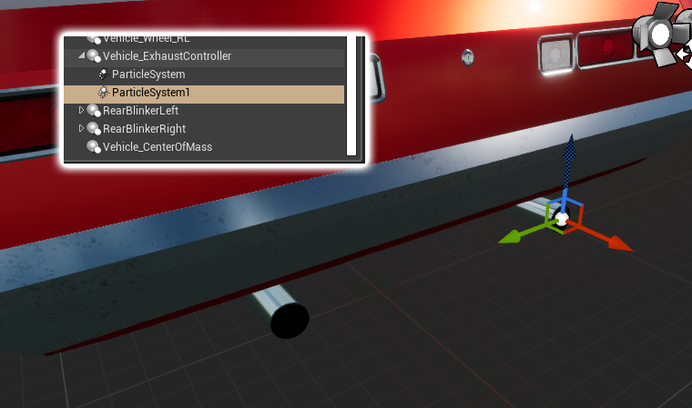

# Exhaust

## Setting up Exhaust Smoke

<!-- side-by-side:40 -->
AVS includes an optional `Vehicle_ExhaustController` component for driving exhaust particles. It drives two parameters — `SmokeVelocity` and `SmokeSize` — on any particle system attached to it.

The plugin ships with an exhaust particle system that works out of the box and is a good starting point for building your own.
<!-- split -->

<!-- /side-by-side -->
