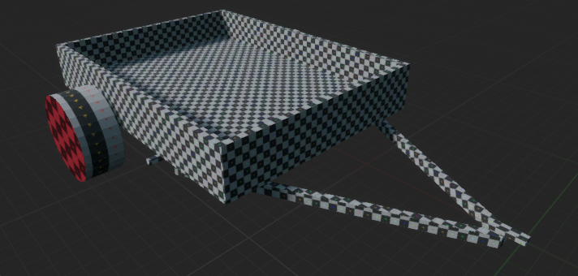
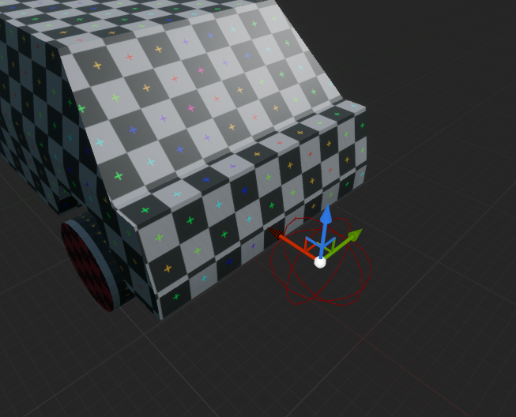
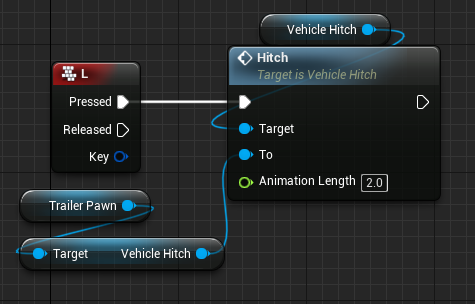

# Hitch / Trailers

## **Basic Understanding**

Trailers in AVS are not their own class. They are just standard AVS vehicles that have a receiving hitch on them. This creates a super versatile workflow for creating trailers since they have access to all the same features of a standard AVS vehicle. For example, you could create a trailer that a second player can "drive" and manage the steering or engine on. This also means all the features created in future updates will translate to your trailers without any additional work.

## **Step 1: Create your trailer "vehicle"**

Create a new vehicle, and set it up like a trailer. Use the [Creating Vehicles](https://avs.overtorque-creations.com/tutorials/Creating-Vehicles) page if needed. There is a basic trailer mesh and wheel included in the plugin if you need one.

## **Step 2: Add a hitch component to your trailer**

Add a new hitch component to your trailer. The location of your hitch component defines were the trailer will be towed from, make sure the X axis (red) is facing forward in respect to the trailer mesh. If you are using the trailer mesh included with the plugin, then the hitch is at zero so you will not need to move the hitch component.

## **Step 2a: Add a collision overlap to your hitch component**

This is only necessary if you will be using the "Hitch to Overlapped" feature. This is an easy way to make nearby hitches connect to each other, and is included since it is the most common use case. Add a collision shape as a child of the hitch component that defines the suitable zone to hitch from.

## **Step 3: Configure your hitch**

Click the hitch component and go to its details panel. Since this is our receiving hitch, change the Hitch Type to "Trailer Hitch". If you need to, you can think of the 'Tow Hitch' setting as a Tow Ball and the Trailer Hitch setting as a Coupler.

## **Step 3a: Explanation of connect types**

The "Connect Types" setting is used to define your different types of hitches. A hitch can only become hitched to another if they share a Connect Type.

For example, you could have a trailer with 2 connect types defined "Standard", and "Semi". This would mean it could hitch to any Tow Hitch with EITHER of those types defined.

## **Step 4: Add a hitch to your towing vehicle**

Open up the vehicle you want to be able to tow the trailer, and add a hitch component to it. Add a collision to it like in step 2a, if you are using those. Leave the hitch type as "Tow Hitch". Move the hitch to the towing location, you will want to make sure the X axis (Red) is pointing forward relative to the trailer.

## **Step 5: Hitch Inputs**

Now it's time to actually hitch these components together. There are a couple options here to do this. In your vehicle blueprint, add a keyboard event (or something of your choice) and set up one of the following options.

Option 1: Hitch to Overlapped

- When called, this will run the hitch function on the 1st of any overlapping hitches. This requires a collision volume be attached to each hitch (Step 2a).

Option 2: Hitch

- When called, this function will attempt to hitch 2 hitches, regardless of their position in the world. This does not teleport the trailer so use wisely.

Regardless of what you choose, you will need to be mindful of how you call these. In single player games it should be safe to call them from any actor at any time. However, in multiplayer games you will only be able to call these from the owning client (the client possessing the pawn, or the server).

## **Step 6: Enjoy trailers!**

That's all there is to it! I put a lot of effort in making this possible so I hope you enjoy it. If you have any questions for me or suggestions to add to this page, you can message me on the discord server or by email. Thanks for using AVS!

