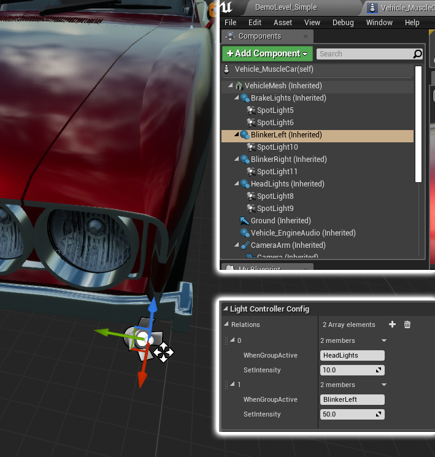
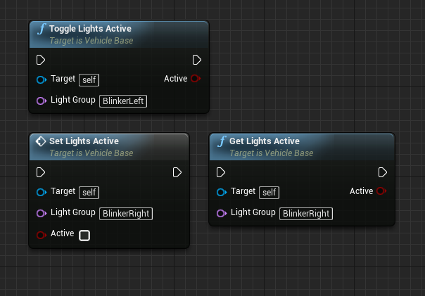
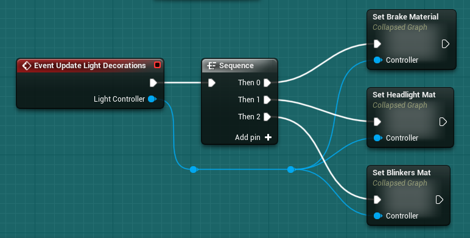

# Vehicle Lights

## Understanding the Basics

Lights in AVS are controlled by `Vehicle_LightController` components placed on your vehicle. Every vehicle has a list of **groups** that the light controllers read to determine the correct intensity. Think of groups as booleans — they are either on or off.

Lights placed as subcomponents of a light controller have their **Intensity** driven automatically, using the relationship settings defined on their controller. When a group is activated, each light controller containing that group loops through its relationships and sets its lights to the intensity of the highest active group in the hierarchy.

That's what lets you build complex setups where every light on the vehicle can be driven by any number of variables.

## Looking at an Example

<!-- side-by-side:50 -->

<!-- split -->
This is the muscle car from the demo project.

When you turn on the headlights in a real car, the blinker lights usually come on too, at a low intensity. The muscle car recreates this by defining a relationship with the `HeadLights` group that sets the light's intensity to 10 when that group is active.

So when the headlights are on, the blinker lights up as well — but since it's lowest in the hierarchy, the `BlinkerLeft` group overrides it whenever that group is also active.

Now imagine code that clicks the blinker on and off by toggling the `BlinkerLeft` group. With the group inactive the blinker drops to 0, or to 10 if the headlights are on. That mimics a real blinker exactly.
<!-- /side-by-side -->

## Controlling Light Groups

<!-- side-by-side:41 -->

<!-- split -->
Activate and deactivate groups with these Blueprint nodes on the vehicle:

- `ToggleLightsActive`
- `SetLightsActive`
- `GetLightsActive`
- `UpdateLights` — applies your changed light groups

> You must call `UpdateLights` after changing light groups. This is for performance — you'll often want to change several groups at once and apply them together.
<!-- /side-by-side -->

## Vehicle Decorations, Driven by Lights

<!-- side-by-side:50 -->

<!-- split -->
When your vehicle lights update, the `UpdateLightDecorations` event fires once per light controller. Use it for extra effects tied to the lights, such as updating materials on the vehicle mesh or playing sounds.

You can also override `UpdateLights` instead if you'd rather handle everything in one pass — just remember to call the parent function.

Light controllers expose two functions for deciding how to update your decorations:

- `GetIntensity`
- `HasActiveLights`
<!-- /side-by-side -->

