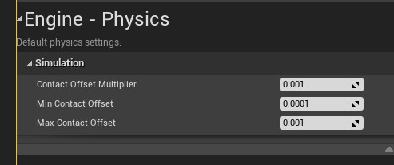
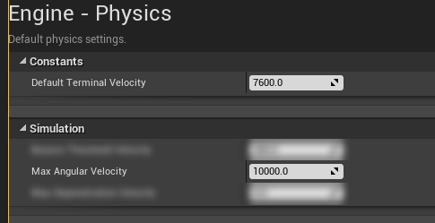
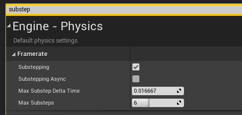
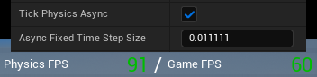

# Recommended Project Settings

## Min/Max Contact Settings

<!-- side-by-side:41 -->

<!-- split -->
When using **Physics Wheels** (not Raycast Wheels), it's strongly recommended to lower the engine's **Physics Contact Offset** values to the minimum values Unreal allows.

By default, Unreal applies a small invisible gap between physics bodies during collision to improve stability. However, for rolling wheels, this can cause an unwanted side effect: **wheels will bounce when crossing between separate surfaces**, even if the surfaces are perfectly level and aligned. The faster the vehicle moves, the more noticeable and disruptive this bounce becomes.

Reducing both the **Min Contact Offset** and **Max Contact Offset** values in the Physics settings (under _Project Settings → Physics_) significantly reduces or eliminates this behavior.

> Note: This issue only applies to **Physics Wheel mode**. **Raycast Wheels are unaffected** by contact offset settings.
>
> The fix was confirmed on UE4. UE5 behavior may differ and hasn't been extensively tested, so verify and adjust as needed.
<!-- /side-by-side -->

## Max Terminal and Angular Velocities

<!-- side-by-side:41 -->

<!-- split -->
Unreal Engine applies limits to how fast physics objects can move and spin. These defaults are too low for realistic vehicles, and may prevent wheels from reaching the speeds they're physically capable of.

For reference:

A wheel with a **35 cm radius** spinning at **10000 degrees per second** reaches a linear surface speed of about **6105 cm/s (≈ 136 MPH)**.

This means if your wheels need to push past that speed, you'll need to increase this value further.
<!-- /side-by-side -->

Update these under _Project Settings → Physics_:

| Setting | Recommended value | Roughly |
|---|---|---|
| Default Terminal Velocity | `7600` cm/s | ≈ 170 MPH |
| Max Angular Velocity | `10000` deg/s | ≈ 136 MPH at a 35 cm wheel radius |

To calculate:

```text
Linear Speed (cm/s) = (Angular Velocity in deg/s × (π / 180)) × Radius in cm
```

Set your value high enough that wheels never hit the ceiling under normal operation.

## Physics Tick Settings

It is highly recommended to choose one of the options below. These options help ensure the physics run at a consistent and stable frame rate. This dramatically reduces physics errors and keeps vehicles stable at low frame rates.

### Option 1: Substepping

<!-- side-by-side:41 -->

<!-- split -->
Substepping divides a single game frame into multiple physics ticks. This means that physics will tick multiple times per frame to reach its target FPS. This is a great option if you want your physics to match the game's FPS in most cases but still stabilize at lower frame rates.

When using substepping, physics will always be locked to your game's FPS when it's above the target. When below the target, substepping will get as close as it can to the target FPS, utilizing the resources you allow it.
<!-- /side-by-side -->

| MaxDelta / MaxSteps | Physics | Stable at |
|---|---|---|
| `0.016667` / 6 | 60 FPS Physics | 15 / 30 FPS |
| `0.013000` / 6 | 90 FPS Physics | 15 / 30 / 60 FPS |
| `0.009400` / 8 | 120 FPS Physics | 15 / 30 / 60 / 90 FPS |

### Option 2: Async Physics

<!-- side-by-side:48 -->
Async physics completely decouples physics from the FPS. Physics are calculated on a separate thread, sent back to the game thread, then interpolated for visual smoothness. If you need the best absolute consistency, this is the option to choose.

> Note 1: Do not use this option in AVS 1.3 (UE5.0 - 5.1)
>
> Note 2: Async Physics in Unreal 5.3 is broken, stick with substepping
<!-- split -->

<!-- /side-by-side -->

| Async Fixed Time Step Size | Physics |
|---|---|
| `0.033333` | 30 FPS |
| `0.016667` | 60 FPS |
| `0.011111` | 90 FPS |
| `0.008333` | 120 FPS |
