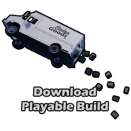

# Advanced Vehicle System Plugin

### **Make vehicles feel awesome right out of the box with AVS Vehicle Physics. Don't waste hours tweaking settings; AVS provides intuitive, modular setups for effortless tuning and fast results. Easily integrate must-have details like tire smoke, vivid skid marks, customizable vehicle lights, exhaust smoke, and immersive engine audio. Most competing solutions force you to buy these separately or build them yourself—AVS bundles everything into a single straightforward package, getting your vehicles road-ready faster than anything else on the market.**

AVS also supports any combination of static mesh wheels and chassis, so you can freely build unique vehicles without rigging or complicated setups—just drop in your meshes, adjust some settings, and drive. It’s fully network replicated and designed specifically with open-world games in mind, continually updated based on community feedback and our own project requirements, making AVS a rock-solid, battle-tested solution for your games. Spend less time wrestling with setups and more time creating killer vehicles exactly how you envision them.

[Embedded media](https://www.youtube.com/embed/KQNQhXzxTr8?embed_config=%7B%22enc%22:%22AXH1ezlLWMFZvRcaLZjlj4Ug9lxzAS_BcNvXfduEJeYXt7Bkf-GBubTkqz3Fuxi7-tAVXHE5Vb4N8hbMpFQsORJBObeQBmcZbeyB1-WldOK2ihFP6e5BCuh82dlluo7AL_k1SuhPxWN0fRx8Vf6iRit0-YxjPqggyT_oJIbhYdkPe8ao%22%7D&errorlinks=1)

[Embedded media](https://www.youtube.com/embed/MNq4VPvIvj0?embed_config=%7B%22enc%22:%22AXH1ezmKFtD-ATCeHwn6Xs9072MJQPHVOoQUT0AJ6jDMS__oOlqbch6LGLBdbVAFiDZZZhjZShLRtu4dx9na-EZsAssh26bFJxJqZxWWNLbjs6IuOe7_NCrSLeIDyihRmwpqZcZHHgZ1xO4PBx6FT1_c2-AYwBkhU5wHom7O749y9xSv%22%7D&errorlinks=1)

