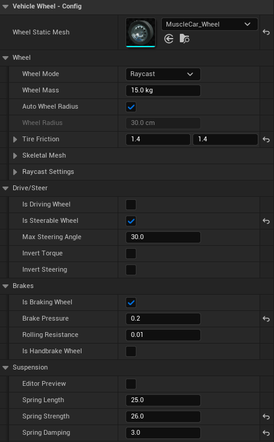

# Vehicle Quick Start Guide

## Download

A simple template is available below. If this is your first vehicle, it's still worth following the tutorial so you understand how the plugin fits together.

- [AVS Template v2 (UE5.2+)](https://drive.google.com/file/d/1EoGBkDWFwpZS5OzPvTGfFD1YEx8MsbHG/view?usp=sharing)
- [Full demo source code](https://avs.overtorque-creations.com/download-demo) — the project shown in the marketing materials

## Requirements

- A Static Mesh or Skeletal Mesh for the chassis and wheels.
  - Static meshes need a separate wheel mesh. A basic static mesh body and wheel are included in the plugin for demo purposes — check **Show Plugin Content** in the view options to see them.
  - Skeletal meshes should be set up for, or similar to, Unreal's `WheeledVehicle` system.
- The Advanced Vehicle System plugin.
- A basic understanding of Unreal Engine. Some steps expect you to create or set up things without step-by-step guidance.

> Using a version of Unreal older than 5.2? Follow the [legacy guide](https://overtorque-creations.com/Dev/Docs/#AVS/tutorials/Quick_Start_Pre_UE5.2.md) instead.

## Step 0: Configure project settings (optional)

Consider making the recommended changes on the [Project Settings page](https://overtorque-creations.com/Dev/Docs/#AVS/general/Project_Settings.md). They dramatically increase physics stability and raise top speed in physics wheel mode.

## Step 1: Configure your inputs

<!-- side-by-side:41 -->

<!-- split -->
Before setting up the vehicle, you need inputs. Head into _Project Settings → Input_ and set up something similar to the image on the left.
<!-- /side-by-side -->

## Step 2: Create the base vehicle

<!-- side-by-side:50 -->

<!-- split -->
**2A**

Create a new Blueprint and choose `AVS_Vehicle` as the parent class.

Name it something like `ProjectName_Vehicle`. Using a shared base makes it easy to share code, settings, and components across every vehicle in your project.

**2B**

- Open the newly created vehicle Blueprint.
- In the **Components** panel, add a `SpringArm` component.
- Attach a `Camera` to the spring arm. This is the vehicle's viewpoint.
- This tutorial doesn't cover camera input, so rotate the spring arm slightly to the side — that way you can see the wheels while driving.
<!-- /side-by-side -->

<!-- side-by-side:48 -->
**2C**

Open the Event Graph.

By default the vehicle isn't running and sits in park. For simplicity, start the engine and shift into drive on BeginPlay so it's ready to go when you hit play.
<!-- split -->

<!-- /side-by-side -->

<!-- side-by-side:48 -->
**2D**

While you're in the event graph, set up the vehicle inputs.
<!-- split -->

<!-- /side-by-side -->

### Optional: Set up automatic shifting

<!-- side-by-side:50 -->

<!-- split -->
AVS 1.2.5 added an option for automatic shifter positions. To use it, change the configuration above slightly.
<!-- /side-by-side -->

<!-- side-by-side:46 -->
In your project input settings, remove the `VehicleBrake` input. Open `VehicleForward` and add your brake keys with a scale of `-1.0`.
<!-- split -->

<!-- /side-by-side -->

<!-- side-by-side:46 -->
In the event graph from step 2, remove the old brake input and replace the `SetThrottleInput` node with `SetThrottleAndBrakeInput`. This node is required for automatic shifting to work correctly.
<!-- split -->

<!-- /side-by-side -->

## Step 3: Creating a vehicle

<!-- side-by-side:32 -->

<!-- split -->
**3A**

Right click your base vehicle Blueprint and select **Create Child Blueprint Class**. This is your actual vehicle, so name it accordingly — this guide uses `Car`.

**3B**

Open your new vehicle Blueprint, select the `VehicleMesh` component, and set it to your mesh. AVS ships a placeholder mesh in its content.

> To see plugin content in the content drawer, check **Show Engine Content** if the plugin is installed to the engine, or **Show Plugin Content** if it's installed to the project.
<!-- /side-by-side -->

<!-- side-by-side:48 -->
**3C**

Wheels in AVS are separate components called `Vehicle_Wheel`. Each one holds the data for the wheel it represents, so every wheel is configured individually.

Add one component per wheel, then reposition each to its place on the vehicle. Name them after their locations — it pays off quickly.
<!-- split -->

<!-- /side-by-side -->

<!-- side-by-side:57 -->
**3D**

Select a wheel and open the **Wheel Config** section.

**Wheel Static Mesh**

- Pick a wheel mesh if you have one. With no mesh selected, the system falls back to a sphere collision using the specified wheel radius.
- In **Raycast** wheel mode the mesh's collision doesn't affect behavior, unless you plan to use the detach wheel feature.
- In **Physics** wheel mode the wheel inherits collision from the selected mesh. Use a simple sphere collision for regular wheels — convex collisions don't roll smoothly at speed.

**Drive / Steer**

- Configure each wheel as a driving or steering wheel based on its position and the vehicle you want.
- Torque may need inverting for wheels flipped 180 degrees.
- Rear steering wheels may need their steering inverted.
<!-- split -->

<!-- /side-by-side -->

## Step 4: Configure your vehicle

**4A**

Select `ClassName(self)` in the components list, or press **Class Defaults**. The details panel has categories prefixed `Vehicle -` — that's where values for the vehicle as a whole live. For now, open **Vehicle - Transmission**.

<!-- side-by-side:48 -->
**4B**

The **Gears** section starts with 2 gears. Gear 0 is always reverse; everything after it is a forward gear.

Add 2 more gears and configure them similar to the image on the right.
<!-- split -->

<!-- /side-by-side -->

| | Gear 0 (reverse) | Gear 1 | Gear 2 | Gear 3 |
|---|---|---|---|---|
| End Speed | 20.0 | 30.0 | 65.0 | 75.0 |
| Start Speed | 0.0 | 5.0 | 25.0 | 50.0 |
| Up Shift | 100.0 | 20.0 | 50.0 | 80.0 |
| Down Shift | 0.0 | 0.0 | 15.0 | 45.0 |
| High RPM | 5500.0 | 5500.0 | 5500.0 | 5500.0 |
| Low RPM | 950.0 | 950.0 | 950.0 | 950.0 |
| Max Torque | 30.0 | 30.0 | 30.0 | 30.0 |
| Min Torque | 5.0 | 5.0 | 5.0 | 5.0 |

### Explanation of gear variables

**End Speed** — the intended maximum speed of this gear. Torque is at Min Torque at this speed and decreases exponentially beyond it. The speed unit comes from the vehicle's `SpeedUnit` setting.

**Start Speed** — the intended minimum speed of this gear. Torque is at Max Torque at this speed and interpolates toward Min Torque as it approaches End Speed. Again, units come from `SpeedUnit`.

**Up / Down Shift** — the speed at which the transmission picks a new gear.

**Min / Max Torque** — these values used to be arbitrary, roughly based on the physics constraint motors in UE4. As of AVS 1.4 they represent `Nm * 0.01`, or hectonewton meters (hNm) — a value of 50 equals 5000 Nm applied at the wheel.

**Low / High RPM** — purely cosmetic for now, since there's no true engine sim under the hood yet. These fake an RPM value by guessing from current engine load and throttle, so there's something to feed cosmetic components like engine audio.

## Step 5: Set up the config assist HUD

The plugin includes a basic HUD to help with building vehicles. This step isn't required, but it's recommended unless you're very comfortable in Unreal.

<!-- side-by-side:48 -->
**5A**

Create a player controller Blueprint and a game mode Blueprint.
<!-- split -->

<!-- /side-by-side -->

<!-- side-by-side:48 -->
**5B**

Open the new player controller and drag off the execution pin on Event BeginPlay. Type "Create Widget" and press Enter, then set the node's class to the VehicleSetup HUD. Take the return value into an **Add to Viewport** node, and set the owning player to `Self`.

> Same content drawer note as before: check **Show Engine Content** (plugin installed to the engine) or **Show Plugin Content** (installed to the project) to find the HUD.
<!-- split -->

<!-- /side-by-side -->

<!-- side-by-side:40 -->
If you need multiplayer, add a check to see if we are on the local controller.
<!-- split -->

<!-- /side-by-side -->

<!-- side-by-side:40 -->
**5C**

Open your level and click the **Blueprints** button. Set the game mode to the one you created, then set your player controller within that game mode.
<!-- split -->

<!-- /side-by-side -->

## Step 6: Test what you have so far

If you've followed along, you should be able to drive. Either set the default pawn in your GameMode to your new vehicle, or place one in the level and set **Auto Possess Player 0** in the details panel.

In game, use your ShiftUp and ShiftDown inputs to move the shifter — that's PRND, not gears — and you'll see it change on the HUD. With the automatic shifter position feature enabled, this happens on its own.

To use the HUD's buttons and sliders, press **Shift + F1** to bring up your mouse cursor. The HUD is also a fast way to find good spring values: whatever you set is applied to every wheel, overriding what you configured earlier.

