# Legacy Vehicle Setup Guide

For Unreal Engine versions older than 5.2. If you're on 5.2 or newer, use the [current Quick Start guide](https://overtorque-creations.com/Dev/Docs/#AVS/tutorials/Quick_Start.md) instead.

## Requirements

- A Static Mesh or Skeletal Mesh for the chassis and wheels.
  - Static meshes need a separate wheel mesh. A basic static mesh body and wheel are included in the plugin for demo purposes — check **Show Plugin Content** in the view options to see them.
  - Skeletal meshes should be set up for, or similar to, Unreal's `WheeledVehicle` system.
- The Advanced Vehicle System plugin.
- A basic understanding of Unreal Engine. Some steps expect you to create or set up things without step-by-step guidance.

## Step 0: Configure project settings (optional)

Consider making the recommended changes on the [Project Settings page](https://overtorque-creations.com/Dev/Docs/#AVS/general/Project_Settings.md). They dramatically increase physics stability and top speed.

## Step 1: Configure your inputs

<!-- side-by-side:41 -->

<!-- split -->
Before setting up the vehicle, you need inputs. Head into _Project Settings → Input_ and set up something similar to the image on the left.
<!-- /side-by-side -->

## Step 2: Create the base vehicle

<!-- side-by-side:50 -->

<!-- split -->
**A.** Create a new Blueprint and choose `AVS_Vehicle` as the parent class. Name it something like `ProjectName_Vehicle` — it usually holds the code, settings, and components shared across every vehicle in your project.
<!-- /side-by-side -->

**B.** Open your new vehicle Blueprint, add a `SpringArm`, and attach a camera to it. This tutorial doesn't set up camera inputs, so rotate the spring arm slightly to the side — that way you can see the wheels while driving.

<!-- side-by-side:48 -->
**C.** Open the Event Graph. The vehicle isn't running and sits in park by default, so for the tutorial vehicle, start the engine and move the shifter to drive.

> As of AVS 1.2 there's a config option for vehicles to spawn with their engines already running.
<!-- split -->

<!-- /side-by-side -->

<!-- side-by-side:48 -->
**D.** Still in the event graph, wire the vehicle up to the inputs you made in step 1.
<!-- split -->

<!-- /side-by-side -->

### Step 2b: Set up automatic shifting (optional)

<!-- side-by-side:50 -->

<!-- split -->
AVS 1.2.5 added an option for automatic shifter positions. To use it, change the configuration above slightly.
<!-- /side-by-side -->

<!-- side-by-side:48 -->
**A.** In your project input settings, remove the `VehicleBrake` input. Open `VehicleForward` and add your brake keys with a value of `-1.0`.
<!-- split -->

<!-- /side-by-side -->

<!-- side-by-side:48 -->
**B.** In the event graph from step 2, remove the old brake input and replace the `SetThrottleInput` node with `SetThrottleAndBrakeInput`. This node is required for automatic shifting to work correctly.
<!-- split -->
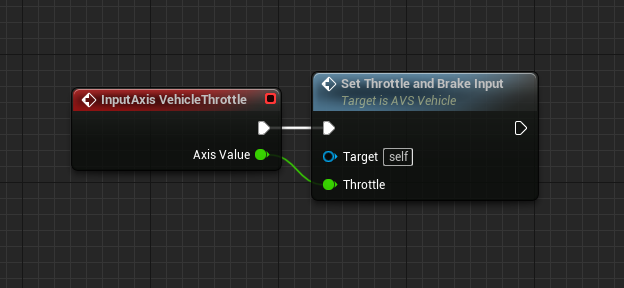
<!-- /side-by-side -->

## Step 3: Create your vehicle

<!-- side-by-side:32 -->
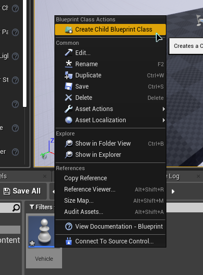
<!-- split -->
**A.** Right click your base vehicle Blueprint and select **Create Child Blueprint Class**. This is your actual vehicle, so name it accordingly — this guide uses `Car`.
<!-- /side-by-side -->

**B.** Open your new vehicle Blueprint, select the `VehicleMesh` component, and set it to your mesh. AVS ships a placeholder mesh in its content. To see it, check **Show Plugin Content** in the content browser — or **Show Engine Content** if you're on UE5.

<!-- side-by-side:48 -->
**C.** Wheels in AVS are separate components called `Vehicle_Wheel`. Each one holds its own data, so every wheel is configured individually.

Add one per wheel, then move each component to the correct location. Naming components after their position on the vehicle pays off later.
<!-- split -->

<!-- /side-by-side -->

## Step 4: Configure your vehicle

**A.** Select `ClassName(self)` in the components list, or press **Class Defaults**. The details panel has four categories prefixed `Vehicle -`, where values for the vehicle as a whole live. For now, open **Vehicle - Transmission**.

<!-- side-by-side:48 -->
**B.** The **Gears** section starts with 2 gears. Gear 0 is always reverse; everything after it is a forward gear. Add 2 more gears and configure them like the image on the right.

### Explanation of gear variables

| Variable | Meaning |
|---|---|
| **End Speed** | Maximum speed of the gear |
| **Start Speed** | Speed at which this gear is at maximum torque |
| **Up Shift / Down Shift** | Speed at which the transmission chooses a new gear |
| **Max Torque** | Torque at the gear's Start Speed |
| **Min Torque** | Torque at the gear's End Speed |
<!-- split -->
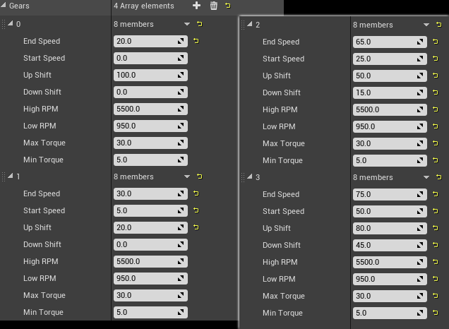
<!-- /side-by-side -->

<!-- side-by-side:48 -->
**C.** Now configure your wheel components. Select a wheel and open the **Wheel Config** section in the details panel, then pick your wheel mesh if you have one.

With no mesh selected, the wheel uses a sphere collision at the specified wheel radius. If you do select a mesh, the collision becomes that mesh's collision — so make sure it's the shape you intend. A simple sphere is recommended.

The image on the right is set up for a rear wheel drive vehicle.

> If you rotated the wheel components so the wheel mesh faces the opposite direction, you may need to check **Invert Torque**.
<!-- split -->
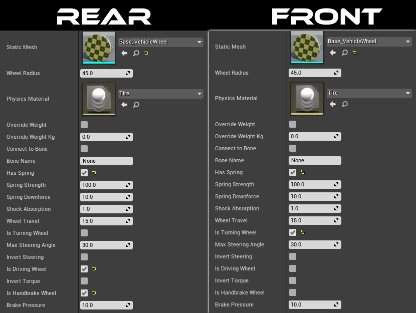
<!-- /side-by-side -->

## Step 5: Set up the config assist HUD

The plugin includes a basic HUD to help with building vehicles. This step isn't required, but it's recommended unless you're very comfortable in Unreal.

<!-- side-by-side:48 -->
**A.** Create a player controller Blueprint and a game mode Blueprint.
<!-- split -->

<!-- /side-by-side -->

<!-- side-by-side:48 -->
**B.** Open the new player controller and drag off the execution pin on Event BeginPlay. Type "Create Widget" and press Enter, then set the node's class to the VehicleSetup HUD. Take the return value into an **Add to Viewport** node, and set the owning player to `Self`.

> In UE4, check **Show Plugin Content** in the view options to find `VehicleSetup_HUD`.
>
> In UE5, if the plugin is installed to the engine, check **Show Engine Content** in the content drawer instead.
<!-- split -->

<!-- /side-by-side -->

<!-- side-by-side:40 -->
If you need multiplayer, add a check to see if we are on the local controller.
<!-- split -->
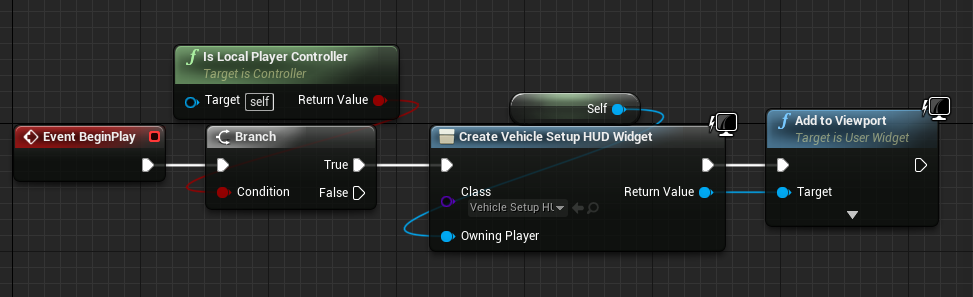
<!-- /side-by-side -->

**C.** Open the main Unreal tab with your loaded level and click the **Blueprints** button. Set your game mode to the one you created, then set your player controller within that game mode.

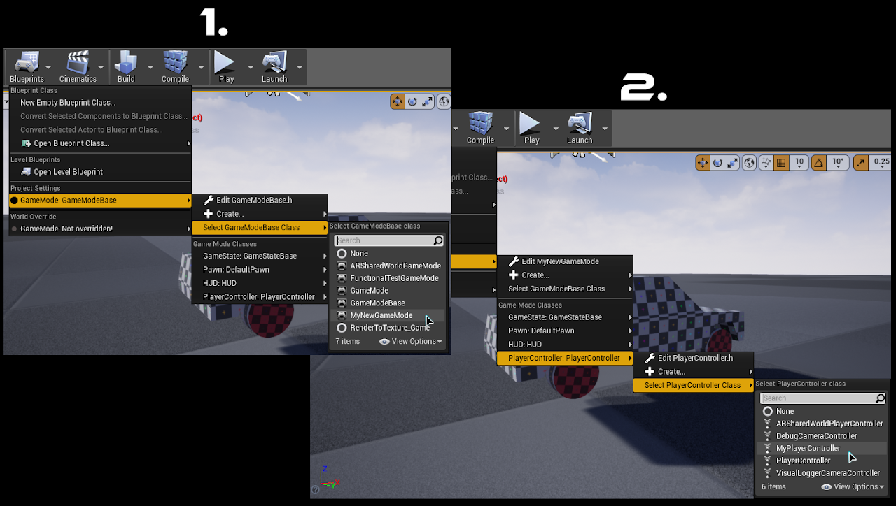

## Step 6: Test what you have so far

If you've followed along, you should be able to drive. Either set the default pawn in your GameMode to your new vehicle, or place one in the level and set **Auto Possess Player 0** in the details panel.

In game, use your ShiftUp and ShiftDown inputs to move the shifter and you'll see it change on the HUD. With the automatic shifter position feature enabled, this happens on its own.

To use the HUD's buttons and sliders, press **Shift + F1** to bring up your mouse cursor. The HUD is also a fast way to find good spring values: whatever you set is applied to every wheel, overriding what you configured earlier.

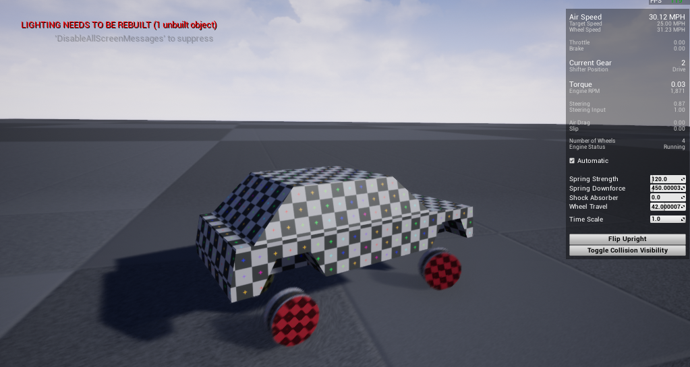

---

**Everything past this point is for skeletal mesh vehicles only.** You'll need to have completed steps 1 through 6, or have a working vehicle already.

## Step 7: Set up your skeletal mesh

This tutorial uses the Buggy mesh from Epic's [Vehicle Game project](https://www.unrealengine.com/marketplace/en-US/learn/vehicle-game).

Whatever skeletal mesh you use needs the vehicle chassis as the root bone, and one bone per animated wheel. Those are the only requirements.

<!-- side-by-side:48 -->
**A.** Set up the physics asset for your mesh. Open the existing one or create a new one, then clear everything in the skeleton tree so you're working with a blank asset.

> This recording was made in Unreal 4.23. Newer versions display the tree a little differently, but the action is the same — select everything in the physics asset and hit delete. As long as no physics constraints are left, you're fine.
<!-- split -->

<!-- /side-by-side -->

**B.** Create the collision for your vehicle chassis. Setting up a physics asset is outside the scope of this guide, so look up a tutorial if you need one. This example uses a multi convex hull, since it's a tutorial vehicle and doesn't need to be especially accurate.

> Make sure you do not create constraints.

<!-- side-by-side:48 -->
**C.** Add some kind of collision shape to each wheel bone. You don't need to configure these shapes — they're never used for collision. AVS uses them as a handle to control the wheel's position.
<!-- split -->
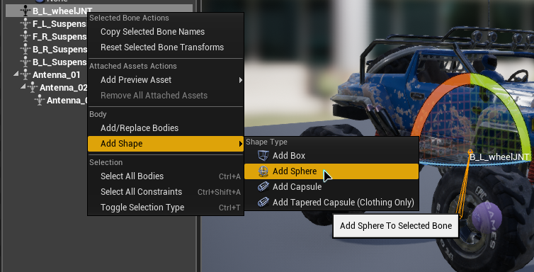
<!-- /side-by-side -->

**D.** Now set up your collision mesh — a separate static mesh acting as the vehicle's collision. This is needed because the skeletal mesh is cosmetic only and doesn't contribute to the vehicle's physics.

You'll need a dummy static mesh, so copy any static mesh into the directory holding your skeletal mesh and name it something like `SM_Buggy_Collision`. The Basic Cube you can spawn in the level editor works fine, but anything will do.

<!-- side-by-side:48 -->
**E.** Copy the collision you made in step 7B. In your physics asset, select the collision body for the chassis, then in the details panel go to _Body Setup → Primitives_ and copy the whole Primitives section.
<!-- split -->
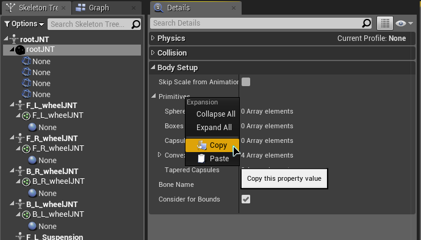
<!-- /side-by-side -->

<!-- side-by-side:48 -->
**F.** In your new collision asset — the dummy static mesh — go to _Collision → Primitives_ and paste. You should now see the vehicle collision on the collision mesh. If you don't, click the collision button in the toolbar and make sure **Simple Collision** is checked.
<!-- split -->
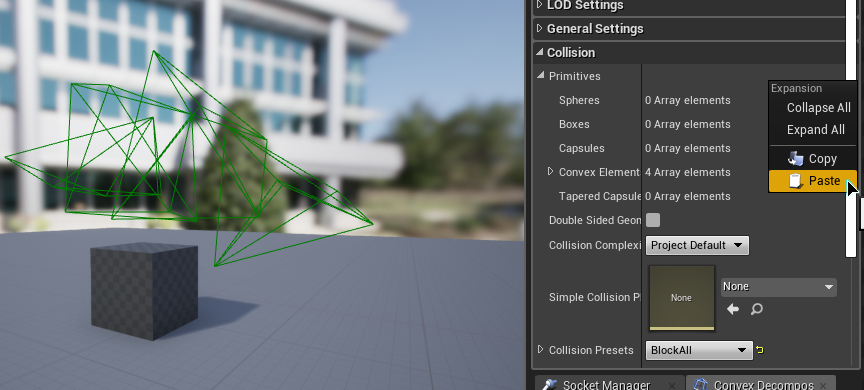
<!-- /side-by-side -->

## Step 8: Add the skeletal mesh to your vehicle

**A.** Open your vehicle's Blueprint and set the `VehicleMesh` component to the collision mesh you created.

<!-- side-by-side:40 -->
**B.** Add a `SkeletalMeshComponent` attached to `VehicleMesh` and set it to your vehicle's skeletal mesh. Then attach any wheels that will animate a bone to that new skeletal mesh component.
<!-- split -->
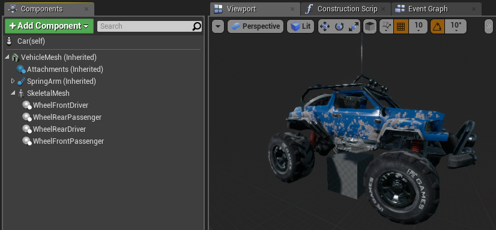
<!-- /side-by-side -->

<!-- side-by-side:65 -->
**C.** Under **Rendering** for `VehicleMesh`, set it to never be visible, or hidden in game only.
<!-- split -->

<!-- /side-by-side -->

<!-- side-by-side:40 -->
**D.** Select your wheel components and clear the static mesh in the wheel config if one is set — this assumes you want the default sphere collisions, though you can use a static mesh if you prefer.

Check **Connect to Bone** and type the associated bone name. If the name is correct, the component snaps to the bone location. Adjust the wheel radius to match your wheel size if you're using the default sphere collision.

Rotation does *not* snap, so make sure the X axis faces forward, the Z axis faces up, and the Y axis faces the outward side of the wheel.
<!-- split -->
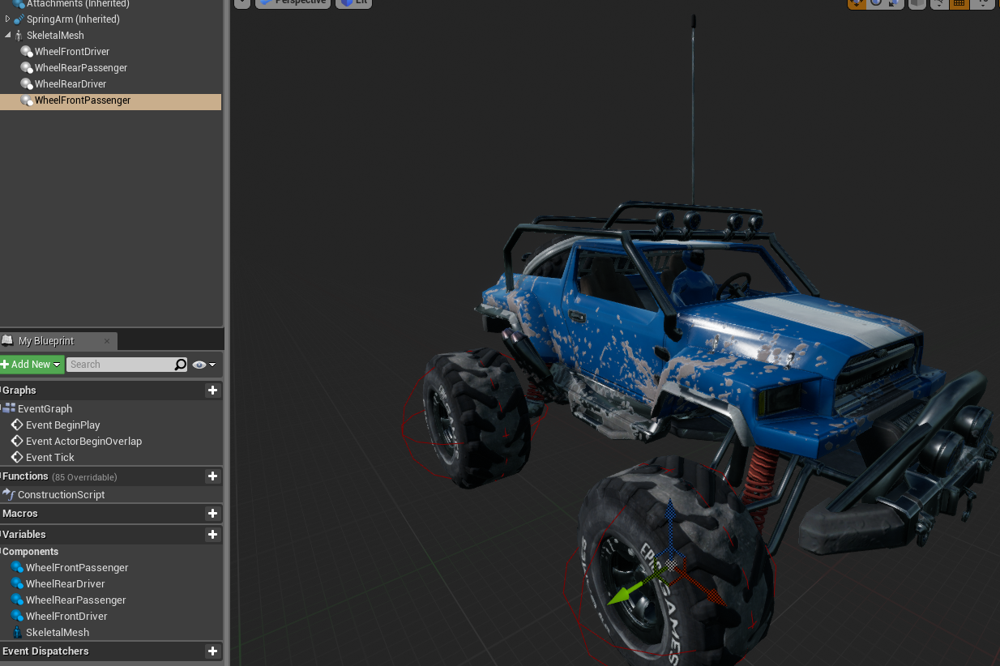
<!-- /side-by-side -->

## Step 9: Drive your vehicle

You should now be able to test. From here you've got a feel for how the system works — play with the settings and build whatever you want.

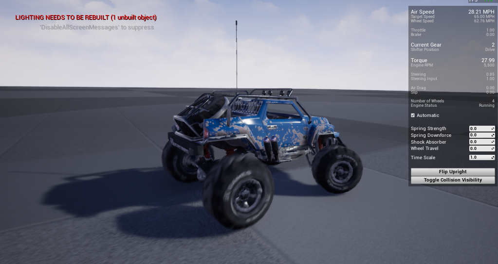
