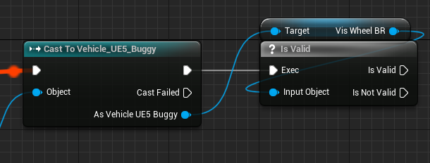
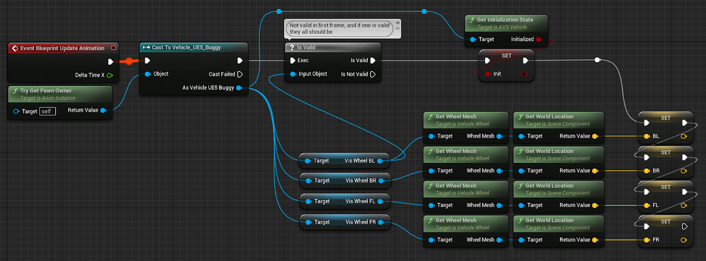
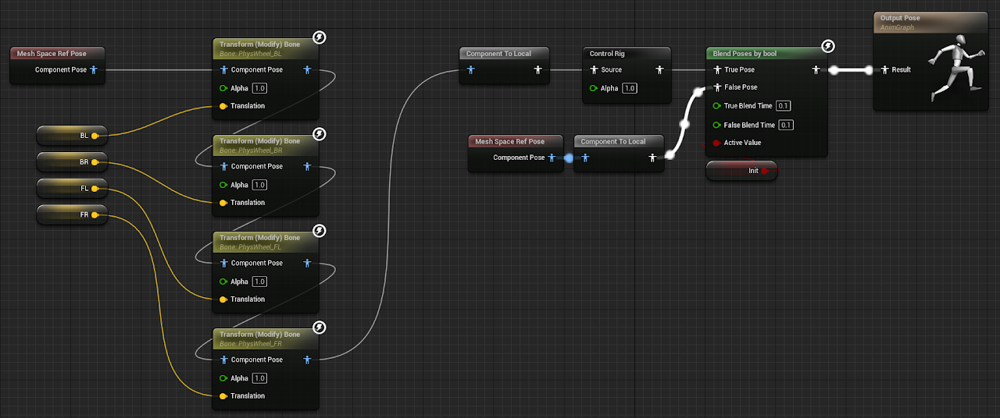
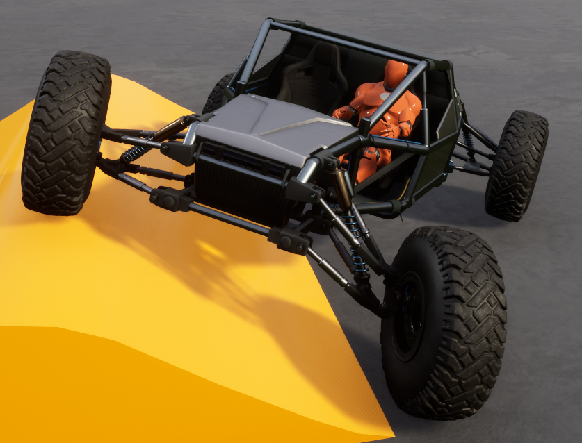

# Skeletal Mesh AnimBP

How to feed wheel data from AVS into your AnimBP, using the UE5 template offroad car as an example.

> Using the **Connect to Bone** feature instead? You want the [Skeletal Wheels](https://overtorque-creations.com/Dev/Docs/#AVS/tutorials/skeletal-mesh/Skeletal_Wheels.md) page.

## Step 1: Create your AnimBP

<!-- side-by-side:57 -->
Create a new AnimBP using the skeleton you want to animate.
<!-- split -->

<!-- /side-by-side -->

## Step 2: Setting up the Event Graph

Select the **Event Graph** tab inside your new AnimBP.

<!-- side-by-side:41 -->

<!-- split -->
### 2A — Variables

Create a variable for each wheel you need data from.
<!-- /side-by-side -->

<!-- side-by-side:41 -->

<!-- split -->
### 2B — Cast to actor

Cast to your vehicle actor.
<!-- /side-by-side -->

<!-- side-by-side:41 -->

<!-- split -->
### 2C — Validate a wheel component

After casting, validate one of your wheel components.

During construction the actor cast passes, but the components haven't been constructed yet — so for a single frame, reading data from the wheel components throws errors. The validate step stops the event graph from continuing until the wheels exist.
<!-- /side-by-side -->

<!-- side-by-side:58 -->

<!-- split -->
### 2D — Save vehicle initialization state

Save the initialization state. You'll use it later to stop the graph animating pre-runtime.
<!-- /side-by-side -->

<!-- side-by-side:58 -->

<!-- split -->
### 2E — Save data from wheels

With access to the wheels, save whatever data your Anim Graph needs.
<!-- /side-by-side -->

Put together, the finished event graph looks like this:

## Step 3: Setting up the Anim Graph

Select the **Anim Graph** tab inside your new AnimBP.

<!-- side-by-side:58 -->

<!-- split -->
### 3A — Transform wheel bones

Transform each of your bones as needed. Here we set bone location in world space, so set the transform node's settings to match.
<!-- /side-by-side -->

<!-- side-by-side:41 -->

<!-- split -->
### 3B — Offroad control rig

If you're following along with the UE5 template offroad car, or you have a control rig of your own, add it here. This example uses the offroad control rig unmodified.
<!-- /side-by-side -->

<!-- side-by-side:58 -->

<!-- split -->
### 3C — Only animate on init

Prevent the anim graph from running until the vehicle has passed initialization. This keeps the mesh in its default pose during initialization and in the editor — useful if you want to snap wheels to bone locations, which is how the offroad car is set up in the AVS demo.
<!-- /side-by-side -->

The finished anim graph:

## Step 4: Test

Set the AnimBP on the skeletal mesh inside your vehicle Blueprint. If everything is wired up correctly, your vehicle should animate during play.

