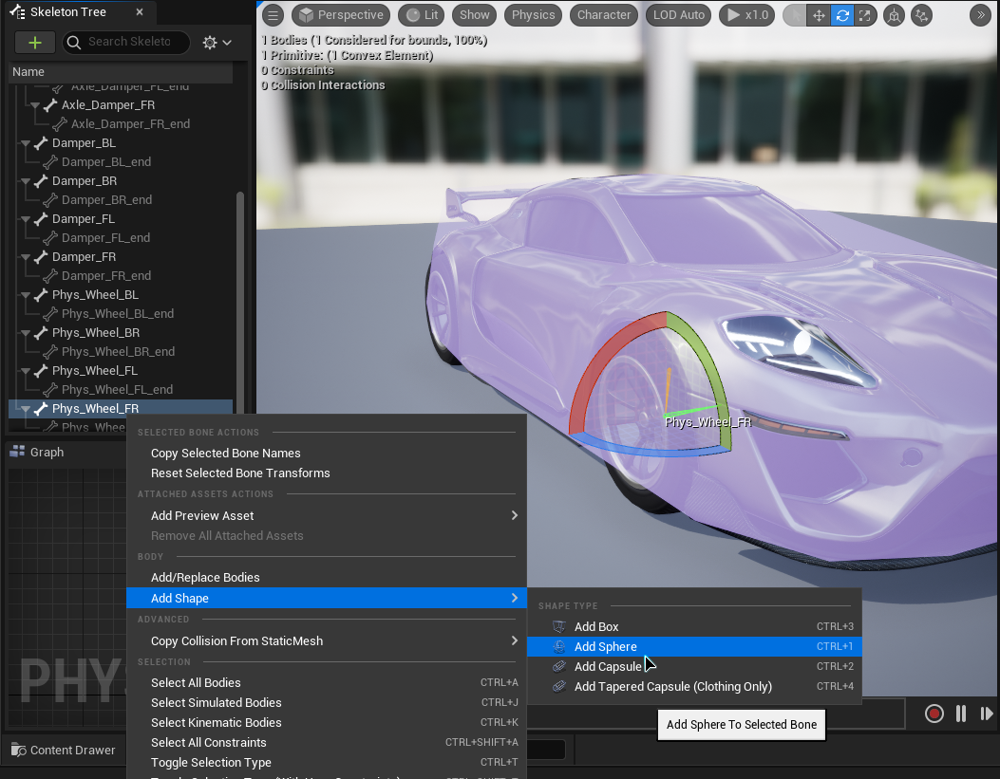
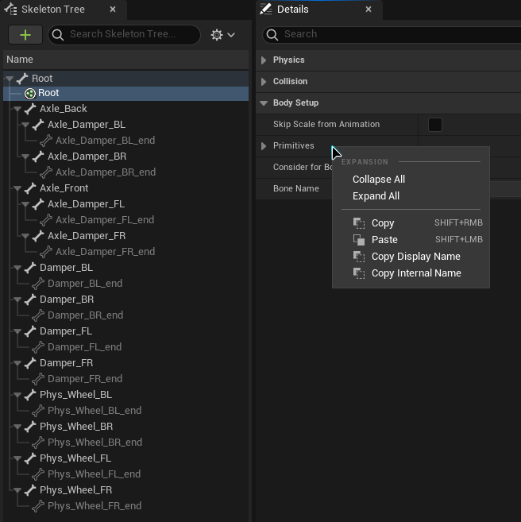
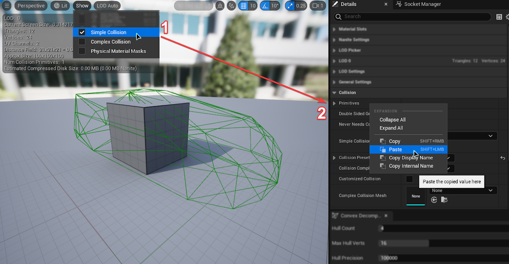
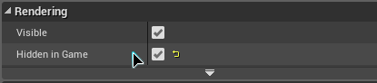
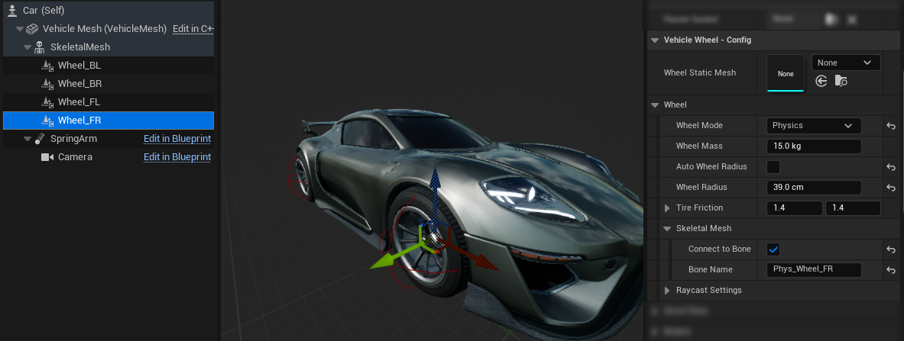
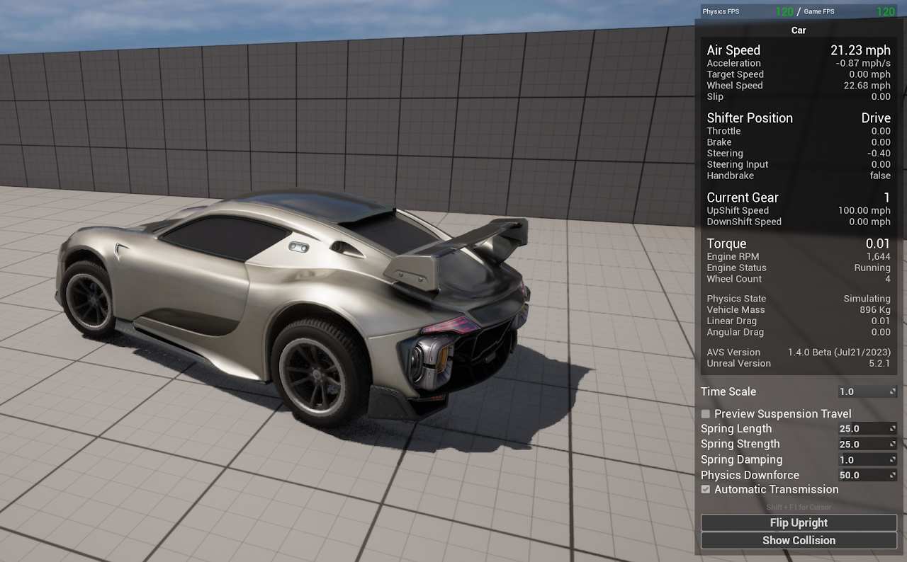
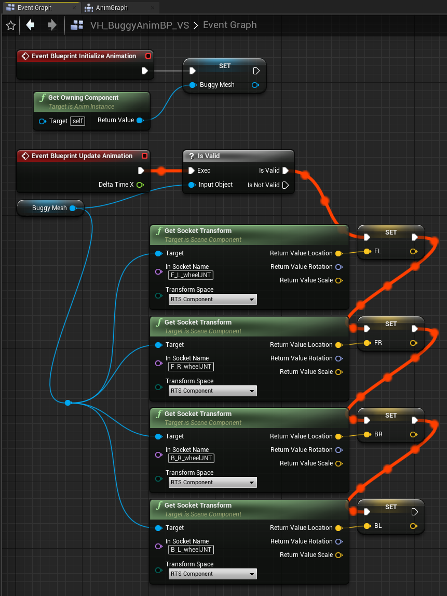

# Skeletal Mesh Wheels (Connect to Bone)

This page is for using wheels within a skeletal mesh with AVS's physics wheel mode, using the "Connect to Bone" feature. If you are using separated wheel meshes (required for raycast wheels), you will need the [Skeletal Animation](https://overtorque-creations.com/Dev/Docs/#AVS_Legacy/Tutorials/Skeletal_Mesh/Skeletal_Animation.md) page instead.

## Step 1: Setup your Skeletal Mesh

For this tutorial I am using the Sports Car from the UE5 Vehicle Template.

<!-- side-by-side:48 -->
**1A**

The first thing that needs to be done is to setup the physics asset for your mesh.

Open the existing one or create a new one to work with. Clear all physics constraints from the asset.
<!-- split -->

<!-- /side-by-side -->

**1B**

Now create the collision for your vehicle chassis, if it does not have one. If you don't know how to do this you might want to look up some tutorials on setting up a physics asset, as it's outside the scope of this one. I'm going to use a multi convex hull on my vehicle, since this is just a tutorial vehicle and doesn't need to be extremely accurate. _**Make sure you do not create constraints!**_

<!-- side-by-side:48 -->
**1C**

Now add some type of collision shape to each wheel bone if they do not already have one. You don't need to set these shapes up because they will not be used for collisions. AVS will use these as a handle to control the wheel's position.

You may need to open settings and click "Show All Bones" if cannot see your wheel bones in the skeleton tree.
<!-- split -->

<!-- /side-by-side -->

**1D**

To enable proper vehicle simulation, we require a collision mesh to serve as the chassis of our vehicle. Keep in mind that the skeletal mesh will serve purely as a cosmetic component. If you already have a suitable Static Mesh representing your vehicle chassis, you can use it instead and skip the remainder of Step 1.

However, if you don't have a collision mesh, you will need to create one:

- Copy a Static Mesh that you wish to use as your vehicle's chassis and paste it into the same directory where you have your Skeletal Mesh. For example, you can name this copied mesh "SM_Buggy_Collision."
- The collision mesh will not be rendered, so you can choose any Static Mesh. A cube mesh is a good option.

<!-- side-by-side:48 -->
**1E**

If you don't already have a collision mesh, we now need to copy the collisions you made in step 1B. In your PhysicsAsset, select the collision body you made for your Chassis, then in the details panel go to _Body Setup > Primitives_ and copy the whole Primitives section.
<!-- split -->

<!-- /side-by-side -->

<!-- side-by-side:32 -->
**1F**

Then in your collision mesh, go to Collision > Primitives and paste them. You should now be able to see the Vehicle collision on your Collision mesh, if not click the collision button in the toolbar make sure "Simple Collision" is checked.
<!-- split -->

<!-- /side-by-side -->

## Step 2: Add Skeletal Mesh to Vehicle

**2A**

Open your vehicle's blueprint, set the _VehicleMesh_ component to your collision mesh.

<!-- side-by-side:40 -->
**2B**

Add a _Skeletal Mesh_ that attaches to the _VehicleMesh_ and set it to use your vehicle's Skeletal Mesh. Then attach any wheels that will be animating a bone to your new skeletal mesh component.
<!-- split -->

<!-- /side-by-side -->

<!-- side-by-side:57 -->
**2C**

Under Rendering for the VehicleMesh, you can set it to never be visible, or be hidden in game only.
<!-- split -->

<!-- /side-by-side -->

**2D**

- Now select your wheel components, select a static mesh if you wish to use one. If not, leave it blank and a sphere collision will be used as a default.
- Make sure your using Physics wheel mode.
- Check the box "Connect to Bone" and type in the associated bone name. If you typed the bone's name correctly, the component will snap to the bone location.
- The rotation will not snap, so make sure you have the X axis facing in the forward direction, and Z axis facing in the upward direction.
- Adjust the Wheel radius to match your wheel size.

## Step 3: Drive your Vehicle

You should now be able to test your vehicle. If all is working your wheel bones should follow the location of it's respective wheel component.

## Step 4: Using AnimBPs with this setup

Due to the way that AVS simulates wheels in this setup, the bone location of wheels in the AnimBP does not update. Fortunately, you can still get the actual bone locations within the event graph of your AnimBP. This means you will need to save your wheel locations in the event graph to be used within the anim graph.

<!-- side-by-side:50 -->

<!-- split -->
### Event Graph

On initialization you need to get a reference to the mesh within the world. In this example I will save it as _BuggyMesh_ (Skeletal Mesh Component Variable Type).

In the UpdateAnimation event you can then use your saved mesh to get the current bone locations, and save them. Here I have 4 wheels that need saved, so I save them using similiar names to their bone name.
<!-- /side-by-side -->

<!-- side-by-side:40 -->
### Anim Graph

Now that you have your variables saved from the Event Graph, your Anim Graph can use them in place of the non-working bone locations.
<!-- split -->

<!-- /side-by-side -->

### Notes

This AnimBP is included in the demo project as part of the Unreal Buggy Vehicle. I highly recommend digging into that content if you have issues.

This AnimBP is named _VH_BuggyAnimBP_VS_
